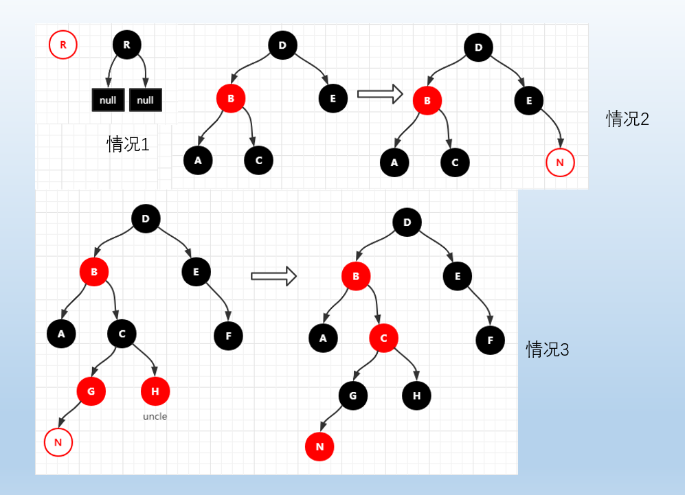
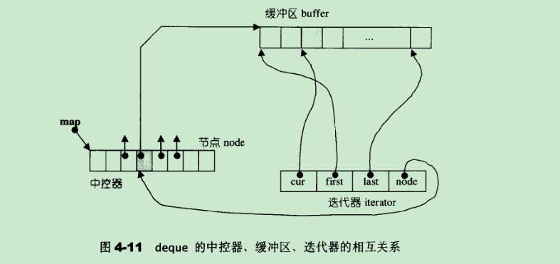

# STL_Notes
我的 stl 笔记, 用来记录 侯捷老师的 stl源码剖析课程


## 基础知识

有了这些知识才能去看源码


### 基础知识------类 

#### 1.1 类内的静态变量 static

优点:

- static的名字在类的作用域内, 是类的一部分, 而不是对象的一部分
- static成员可以是私有成员
- 所有对象**共享**同一份数据
- 类内声明，类外初始化
- 在编译阶段分配内存


#### 1.2 静态成员函数

- 在类中声明函数的前面加static就成了静态成员函数, 可以通过**对象**来访问, 也可以通过**类名**来访问( 静态函数独享 )
- 所有对象共享同一个函数
- 静态成员函数**只能访问静态成员**变量, 静态成员函数没有this指针，既然它**没有指向某一对象**，就无法对一个对象中的非静态成员进行默认访问

泛整型可以类内直接初始化，包括bool short int long等，其余类型包括float，double及string等都不可以。

```c++
class A{
public:
	static int staint;
};
int A::staint = 0;
```


#### 2.1 操作符 重载

作用 : 对已有的运算符重新进行定义，赋予其另一种功能，以适应不同的数据类型

一般的重载运算符

- 加号运算符重载
- 左移运算符重载    :: 可以输出自定义数据类型
- 递增运算符重载
- 赋值运算符重载
- 关系运算符重载
- 函数调用运算符重载

Note:    ::  .*    .    ?=   不能重载


### 基础知识 ------ 模板

​	**泛型编程**就是以独立于任何特定类型的方式编写代码, 使用泛型程序时， 需要提供具体程序实例所操作的类型或值. 
​	泛型程序设计背后有一种隐含的共性：模板机制
​	why: 除了**类型**之外， 其余代码看起来是**相同**的。

包括: 

- 函数模板
- 类模板

#### 1 函数模板

函数模板提供了一种函数行为，该函数行为可以用多重不同类型进行调用。也就是说，函数模板代表一个函数家族。

```c++
//尖括号内的是    一个或者多个模板形参
//模板形参定义了特定类型的局部变量但是不初始化， 只有当运行时才初始化. 
template<typename T>
int compare(const T &a, const T &b){
    if(a <b) return -1;
    else if(a >b) return 1;
    else return 0; 
}

//使用函数模板时, 编译器会自己推断哪个或者哪些模板实参绑定到形参
//一旦编译器确定了实际的模板实参， 就是, 实例化了函数模板的一个实例
cout<< compare(1, 0);
```

#### 2 类模板

类模板与函数模板区别主要有两点：

- 类模板**没有**自动类型**推导**的使用方式, 也就是你必须要指定具体的类别

- 类模板在模板参数列表中可以有默认参数

类模板中成员函数和普通类中成员函数创建时机是有区别的：

- 普通类中的成员函数一开始就可以**创建**
- 类模板中的成员函数在**调用**时才创建,(**编译时多态**)

#### 2.1 类模板的使用

```c++
template<class NameType, class AgeType = int>
class Person{};

void test01(){
    // 错误 类模板使用时候，不可以用自动类型推导
    // Person p("孙悟空", 1000);

    //必须使用显示指定类型的方式，使用类模板
    Person <string ,int>p("孙悟空", 1000);
}

void test02(){
    //类模板中的模板参数列表 可以指定默认参数
    Person <string> p("猪八戒", 999); 
}
```


#### 2.2 类模板  做 函数参数

一共有三种传入方式：

- 指定传入的类型 --- 直接显示对象的数据类型**( 最常用 )**
- **参数**模板化 --- 将对象中的参数变为模板进行传递
- 整个**类模板**化 --- 将这个对象类型 模板化进行传递

```c++
template<class NameType, class AgeType = int>
class Person{};

//1、指定传入的类型
void printPerson1(Person<string, int> &p){
    p.showPerson();
}
void test01(){
	Person <string, int >p("孙悟空", 100);
	printPerson1(p);
}

//2、参数模板化
template <class T1, class T2>
void printPerson2(Person<T1, T2>&p){
    p.showPerson();
    cout << "T1的类型为： " << typeid(T1).name() << endl;
    cout << "T2的类型为： " << typeid(T2).name() << endl;
}

void test02(){
Person <string, int >p("猪八戒", 90);
printPerson2(p);
}

//3、整个类模板化
template<class T>
void printPerson3(T & p){
    cout << "T的类型为： " << typeid(T).name() << endl;
    p.showPerson();
}
void test03(){
    Person <string, int >p("唐僧", 30);
    printPerson3(p);
}
int main() {
    test01();
    test02();
    test03();
    system("pause");
    return 0;
}
```


```c++
template<class T>
class stack{
private:
    vector <T> elem(n);
public:
    void pop();
    void push(T);
};


//可以有非模板类型参数, 非模板类型参数是有限制的, 可以是长整数, 或者指向外部链接对象的指针
template<class T, int max> stack{};

//在定义函数时, 模板定义了几个形参就要带着几个形参
template<class T, int max> stack :: pop(){
    
}
```

#### 3 特化 偏特化

偏特化的定义: 提供另一份 template 的定义式, 本是一就是templatized

```c++
// 泛化版本
template <class T, class Allocalloc>
class vector
{
};

// 个数的偏特化  -  原来是两个模板参数, 现在是一个
// 针对某个类型做特别的优化
template<class Alloc>
class vector<bool, Alloc>
{
};

//范围的偏特化  -指针类型
template<class T>
class demo{};

template<class T>
class demo<T*>{
};
```


## 数据结构

### 数组

- 数组是存放在**连续内存**空间上的**相同类型数据**的集合。
- 正是因为数组的在内存空间的地址是连续的，所以我们在删除或者增添元素的时候，就难免要**移动**其他元素的地址。
- 数组的下标 从 `0` 开始

#### 数组的中位数

- 长度为`len`, 奇数: 正中间, 偶数中间偏右
- 使用下标时, a[l, r]  $\frac{l+r}{2}$中间靠左


### 字符串

- 字符串**比较大小**，**不是**以字符串的**长度**直接决定，而是从最左边第一个字符开始比较，大者为大，小者为小，若相等，则继续按字符串顺序比较后面的字符


### 树

### 1.1 基础知识

| 名词     | 解释                                  |
| -------- | ------------------------------------- |
| 路径长度 | 根结点到 某个结点 所经过的边数        |
| 深度     | **根节点**到任意节点的路径长度        |
| 高度     | 某节点到 最深 **叶子**节点 的路径长度 |
| **大小** | 所有的 (后代)节点的 总数              |


### 1.1 完全二叉树


设当前元素在**数组**中以 **R[i]** 表示(下标从**零**开始)，那么，

(1) 它的**左孩子结点**是：**R[2\*i+1]**;

(2) 它的**右孩子结点**是：**R[2\*i+2]**;

(3) 它的**父结点**是：**R[(i-1)/2]**;


当根节点 的下标 从1 开始

(1) 它的**左孩子结点**是：**R[2\*i]**;

(2) 它的**右孩子结点**是：**R[2\*i+1]**;

(3) 它的**父结点**是：**R[i/2]**;


### 1.2 二叉搜索树

>  任何节点的键值一定**大于左子树**中 每一个节点的键值, 并且**小于右子树** 中 每一个节点的键值

能够提供**对数时间**的访问元素插入和访问


### 1.3 AVL( 绝对平衡二叉树 )

>  任何子节点的高度最多相差 1 


### N叉树

```c++
class Node {
public:
    int val;
    vector<Node*> children;

    Node() {}

    Node(int _val) {
        val = _val;
    }

    Node(int _val, vector<Node*> _children) {
        val = _val;
        children = _children;
    }
};


// 用图来表示树, tree[i] 是 i 的 孩子的集合 
vector<vector<int > > tree;


// 每棵树的孩子数量 
tree[0].size();

// 每棵树的大小 等于 1 加上 孩子的权重
vector<int> weight();
for(int i = len-1; i>-1; --i){
    auto &childs =tree[i];
    for( auto child: childs){
        weight[i] += (1+ weight[child]);
        // cout<< "parent="<< i<< "\tchild="<< child<<"\tw="<< weight[i] <<endl;
    }


}
```


#### B+树


B+ 树满足以下特性：

- 所有的**叶子结点**都在同一层；
- 非叶子结点除了保存数据外，还保存着其他子树的信息与索引结构信息；
- 相邻**叶子结点**之间通过指针相连，形成有序链表；
- 所有关键字都在叶子结点出现，且叶子结点按关键字大小顺序排序，并且每个叶子结点都有一个指针指向下一个叶子结点。


#### B-树


B- 树也是一种多叉树，与 B+ 树类似，它的每个节点可以拥有多个子节点。B- 树是 B+ 树的一种变体，它与 B+ 树的区别在于：

- B- 树的**非叶子节点**也可以存储数据记录；
- B- 树的非叶子节点存储的键值对可以重复；
- B- 树允许节点分裂出新的非叶子节点。


### 1.1 红黑树 RB_tree 与 AVL( 平衡二叉树 )

参考资料

- [红黑树的详细实现 (C++)_c++ 实现红黑树_code_peak 的博客 - CSDN 博客](https://blog.csdn.net/code_peak/article/details/120643910)

比较:

- AVL时间复杂度优于RB
- RB插入删除比 AVL更加容易控制
- 整体性能优于 AVL

红黑树是一棵**二叉搜索树**，它在每个节点增加了一个存储位记录节点的颜色，可以是RED,也可以是BLACK；通过任意一条从根到叶子简单路径上颜色的约束，红黑树保证**最长路径不超过最短路径的二倍**，因而近似平衡。


#### 红黑树的性质

- 每个节点颜色不是黑色，就是红色
- 根节点是**黑色**的
- 如果一个节点是红色，那么它的两个子节点就是黑色的（没有**连续的红节点**）
- 对于每个节点，从该节点到其后代叶节点的简单路径上，均包含**相同**数目的**黑色**节点

根据规则4 : **新增**节点必定为**红** ( 添加黑色的就会破坏规则4 )

根据规则3 : 新增节点之父必为**黑**

注意: 每个**叶节点**都有两个空节点，一般在示例图中需要它的时候就可以把它看成两个**黑色**的节点，不需要的时候可以**忽视它**。

速记: **红黑树 的红是指 新增节点必为红, 红父只能黑子**

#### 插入操作

- **情况 1**：当红黑树为**空树**时，新插入红色节点成为**根节点**，必须将其变成黑色。
- **情况 2**：插入新的红色节点的父节点为黑色，并**不会影响**红黑树的平衡，直接插入即可。
- **情况 3**：插入的新的红色节点的父节点是红色，若叔叔结点为红色，则祖父结点一定为黑色，将祖父结点变为红色，而父节点和叔叔结点变为黑色。因为红色结点上移，出现连续的红色节点，形成了情况 4，这将再情况 4 中说明。
- **情况 4**：插入的新的红色节点的父节点是红色，如果叔叔节点是黑色，且新的节点在父节点右边，则先以父节点进行左旋转，形成了情况 5，在情况 5 中处理。
- **情况 5**：插入新的红色节点的父节是红色 ，如果叔叔节点是黑色，且新节点在父节点左边，则先将父节点变成黑色，但是违反了规则 5（黑色节点数目不相同），必须再将祖父节点变成红色，以祖父节点进行右旋（直觉上，节点 F 的左边路径会多一个黑色节点，可以通过右旋把黑色转掉）。
- **注意**：以上都在讨论新插入的红色节点的父节点是红色，且父节点是祖父节点的左分支情况，如果是在右分支，其处理是**镜像**的，只需要左右互换一下就可以了。





#### 代码实现

key + data = value

> 当使用模板类时，每个节点都需要知道其存储值的类型，即需要将模板参数 T 传递给每个节点。这种做法会使代码变得更加复杂，因为节点类的定义中需要增加模板参数，而且每个操作都需要了解节点的值类型。此外，模板类还会使代码量变大，不利于维护。因此，从代码的简洁性和可维护性出发，设计一个基类作为红黑树节点的父类显然更加合适。
>
> 另外，将节点的共同部分定义在基类中，值类型定义在派生类中的方式，符合面向对象编程的原则。通过这种方式，基类只包含与节点相关的通用信息，便于进行公共操作，同时派生类可以根据具体需求扩展功能。这种做法既方便了代码的维护，也增强了代码的灵活性。

#### 基类与迭代器基类实现

- 三个指针, 父指针, 两个孩子指针
- 颜色

```c++
// 定义节点颜色
typedef bool __rb_tree_color_type;
// const bool red = false;
const __rb_tree_color_type __rb_tree_red = false;
const __rb_tree_color_type __rb_tree_black = true;

// 定义树的结点 基类  相同的部分
// 只有指针域
struct __rb_tree_node_base{
  typedef __rb_tree_color_type color_type;
  color_type color; 
    // 基类的指针类型
  typedef __rb_tree_node_base* base_ptr;
    // 三个指针, 父指针, 两个孩子指针
  base_ptr parent;
  base_ptr left;
  base_ptr right;

  static base_ptr minimum(base_ptr x){
    while (x->left != 0) x = x->left;
    return x;
  }

  static base_ptr maximum(base_ptr x){
    while (x->right != 0) x = x->right;
    return x;
  }
};

// 具体的红黑树 结点类
template <class Value>
struct __rb_tree_node : public __rb_tree_node_base{
  typedef __rb_tree_node<Value>* link_type;
  Value value_field;
};


// iterator基类 的实现, 注意, 只在基类上走
struct __rb_tree_base_iterator{
  typedef __rb_tree_node_base::base_ptr base_ptr;
  typedef bidirectional_iterator_tag iterator_category;
  typedef ptrdiff_t difference_type;
  base_ptr node;

    // 找到比他大的点
  void increment(){
    if (node->right != 0) {
      node = node->right;
      while (node->left != 0)
        node = node->left;
    }
    else {
        // node-> right == 0
      base_ptr y = node->parent;
      while (node == y->right) {
        node = y;
        y = y->parent;
      }
      if (node->right != y)
        node = y;
    }
  }

  void decrement(){
    if (node->color == __rb_tree_red &&
        node->parent->parent == node)
      node = node->right;
    else if (node->left != 0) {
      base_ptr y = node->left;
      while (y->right != 0)
        y = y->right;
      node = y;
    }
    else {
      base_ptr y = node->parent;
      while (node == y->left) {
        node = y;
        y = y->parent;
      }
      node = y;
    }
  }
};


```

#### 红黑树与迭代器模板实现

红黑树实现要点速览

- 只有一个头节点(**哨兵**) 指针, 且头结点的 left 指针指向红黑树中的**最小**元素节点，right 指针则指向红黑树中的**最大**元素节点。
- 

```c++
template <class Value, class Ref, class Ptr>
struct __rb_tree_iterator : public __rb_tree_base_iterator{
  typedef __rb_tree_node<Value>* link_type;
  // constructor
  __rb_tree_iterator() {}
  __rb_tree_iterator(link_type x) { node = x; }
  __rb_tree_iterator(const iterator& it) { node = it.node; }

  reference operator*() const { return link_type(node)->value_field; }
#ifndef __SGI_STL_NO_ARROW_OPERATOR
  pointer operator->() const { return &(operator*()); }
#endif /* __SGI_STL_NO_ARROW_OPERATOR */

  self& operator++() { increment(); return *this; }
  self operator++(int) {
    self tmp = *this;
    increment();
    return tmp;
  }
    
  self& operator--() { decrement(); return *this; }
  self operator--(int) {
    self tmp = *this;
    decrement();
    return tmp;
  }
};


template <class Key, class Value, class KeyOfValue, class Compare,
          class Alloc = alloc>
class rb_tree {
protected:
      typedef __rb_tree_node<Value> rb_tree_node;
    typedef __rb_tree_node* link_type
protected:
    // 以下是 rbtree 的所有成员
    size_type node_count;
    // 只有一个头节点(哨兵) 指针
    // 头结点的 left 指针指向红黑树中的最小元素节点，right 指针则指向红黑树中的最大元素节点。
    link_type header;
    Compare key_compare;
  
    // 用来获得 (虚拟节点) 的指针
  link_type& root() const { return (link_type&) header->parent; }
  link_type& leftmost() const { return (link_type&) header->left; }
  link_type& rightmost() const { return (link_type&) header->right; }

    // 用来获得x 的成员
  static link_type& left(link_type x) { return (link_type&)(x->left); }
  static link_type& right(link_type x) { return (link_type&)(x->right); }
  static link_type& parent(link_type x) { return (link_type&)(x->parent); }
  static reference value(link_type x) { return x->value_field; }
  static const Key& key(link_type x) { return KeyOfValue()(value(x)); }
  static color_type& color(link_type x) { return (color_type&)(x->color); }
    
    
private:
    void init() {
        // 申请内存空间, 作为红黑树的 头结点
        header = get_node();
        // 函数为 static color_type& color(base_ptr x) { return (color_type&)(link_type(x)->color); }
        color(header) = __rb_tree_red; 
        // 将根节点的指针初始化为 nullptr
        root() = 0;
        // 将最左侧节点的指针初始化为头结点。
        leftmost() = header;
        rightmost() = header;
      }
    	
    	// 创建节点
      link_type create_node(const value_type& x) {
        link_type tmp = get_node();
        __STL_TRY {
          construct(&tmp->value_field, x);
        }
        __STL_UNWIND(put_node(tmp));
        return tmp;
 	   }
    	// 复制节点
      link_type clone_node(link_type x) {
        link_type tmp = create_node(x->value_field);
        tmp->color = x->color;
        tmp->left = 0;
        tmp->right = 0;
        return tmp;
      }

// --------------------以下是接口----------------    
public:    
                                // accessors:
  Compare key_comp() const { return key_compare; }
  iterator begin() { return leftmost(); }
  const_iterator begin() const { return leftmost(); }
  iterator end() { return header; }
  const_iterator end() const { return header; }
  reverse_iterator rbegin() { return reverse_iterator(end()); }
  const_reverse_iterator rbegin() const { 
    return const_reverse_iterator(end()); 
  }
  reverse_iterator rend() { return reverse_iterator(begin()); }
  const_reverse_iterator rend() const { 
    return const_reverse_iterator(begin());
  } 
  bool empty() const { return node_count == 0; }
  size_type size() const { return node_count; }
  size_type max_size() const { return size_type(-1); }

  void swap(rb_tree<Key, Value, KeyOfValue, Compare, Alloc>& t) {
    __STD::swap(header, t.header);
    __STD::swap(node_count, t.node_count);
    __STD::swap(key_compare, t.key_compare);
  }
    
    
public:
                                // insert/erase
  pair<iterator,bool> insert_unique(const value_type& x);
  iterator insert_equal(const value_type& x);
    
 public:   
  iterator find(const key_type& x);
  const_iterator find(const key_type& x) const;
  size_type count(const key_type& x) const;
  iterator lower_bound(const key_type& x);
  const_iterator lower_bound(const key_type& x) const;
  iterator upper_bound(const key_type& x);
  const_iterator upper_bound(const key_type& x) const;
  pair<iterator,iterator> equal_range(const key_type& x);
  pair<const_iterator, const_iterator> equal_range(const key_type& x) const;
};

// link_type __copy (link_type x, link_type p)实现, x为根节点, p 为 另一个 头结点(header/dump)
// 复制一棵以 x 为根节点的红黑树
// 因为有一个父节点, 所以需要 正确连接起来
template <class K, class V, class KeyOfValue, class Compare, class Alloc>
typename rb_tree<K, V, KeyOfValue, Compare, Alloc>::link_type 
rb_tree<K, V, KeyOfValue, Compare, Alloc>::__copy(link_type x, link_type p) {
  // top 为 根节点
  link_type top = clone_node(x);
  // 设置新根节点的父指针
  top->parent = p;

  __STL_TRY {
    if (x->right)
      // 若原树存在右子树，则递归复制右子树，并将返回的指针设置为新根节点的右孩子
      top->right = __copy(right(x), top);
    p = top;
    x = left(x);

    while (x != 0) {
      // 依次递归复制左子树，并设置为新树的左孩子
      link_type y = clone_node(x);
      p->left = y;
      y->parent = p;
      if (x->right)
        // 若左子树存在右子树，则递归复制右子树，并将返回的指针设置为新左子树的右孩子
        y->right = __copy(right(x), y);
      p = y;
      x = left(x);
    }
  }
  // 在复制过程中，如果发生异常，则需要释放已经分配的内存，并回滚操作
  __STL_UNWIND(__erase(top));

  // 返回新红黑树的根节点
  return top;
}

```


#### 旋转操作

- 旋转是**节点指针**修改的艺术
- 旋转是让一个节点成为其子节点的孩子的过程
- 通过重新排列子树,改变**树的结构**, 目的是**减少树的高度**. 使得, 红黑树:最大高度为log(n), **较大**的子树**上移**,较小的子树下移, 不会影响元素的顺序

```c++
//-----------------[旋转操作]--------------------
// 左旋转红黑树, 将一个节点的右子节点变为该节点的父节点，而该节点成为其右子节点的左子节点
inline void 
__rb_tree_rotate_left(__rb_tree_node_base* x, __rb_tree_node_base*& root){
  __rb_tree_node_base* y = x->right;
  x->right = y->left;
  if (y->left !=0)
    y->left->parent = x;
  y->parent = x->parent;

  if (x == root)
    root = y;
  else if (x == x->parent->left)
    x->parent->left = y;
  else
    x->parent->right = y;
  y->left = x;
  x->parent = y;
}

inline void 
__rb_tree_rotate_right(__rb_tree_node_base* x, __rb_tree_node_base*& root)
{
  __rb_tree_node_base* y = x->left;
  x->left = y->right;
  if (y->right != 0)
    y->right->parent = x;
  y->parent = x->parent;

  if (x == root)
    root = y;
  else if (x == x->parent->right)
    x->parent->right = y;
  else
    x->parent->left = y;
  y->right = x;
  x->parent = y;
}


// 插入或删除节点后重新平衡红黑树
// 对树进行旋转、颜色翻转等操作
inline void 
__rb_tree_rebalance(__rb_tree_node_base* x, __rb_tree_node_base*& root)
{
  x->color = __rb_tree_red;
  while (x != root && x->parent->color == __rb_tree_red) {
    if (x->parent == x->parent->parent->left) {
      __rb_tree_node_base* y = x->parent->parent->right;
      if (y && y->color == __rb_tree_red) {
        x->parent->color = __rb_tree_black;
        y->color = __rb_tree_black;
        x->parent->parent->color = __rb_tree_red;
        x = x->parent->parent;
      }
      else {
        if (x == x->parent->right) {
          x = x->parent;
          __rb_tree_rotate_left(x, root);
        }
        x->parent->color = __rb_tree_black;
        x->parent->parent->color = __rb_tree_red;
        __rb_tree_rotate_right(x->parent->parent, root);
      }
    }
    else {
      __rb_tree_node_base* y = x->parent->parent->left;
      if (y && y->color == __rb_tree_red) {
        x->parent->color = __rb_tree_black;
        y->color = __rb_tree_black;
        x->parent->parent->color = __rb_tree_red;
        x = x->parent->parent;
      }
      else {
        if (x == x->parent->left) {
          x = x->parent;
          __rb_tree_rotate_right(x, root);
        }
        x->parent->color = __rb_tree_black;
        x->parent->parent->color = __rb_tree_red;
        __rb_tree_rotate_left(x->parent->parent, root);
      }
    }
  }
  root->color = __rb_tree_black;
}


inline __rb_tree_node_base*
__rb_tree_rebalance_for_erase(__rb_tree_node_base* z,
                              __rb_tree_node_base*& root,
                              __rb_tree_node_base*& leftmost,
                              __rb_tree_node_base*& rightmost)
{
  __rb_tree_node_base* y = z;
  __rb_tree_node_base* x = 0;
  __rb_tree_node_base* x_parent = 0;
  if (y->left == 0)             // z has at most one non-null child. y == z.
    x = y->right;               // x might be null.
  else
    if (y->right == 0)          // z has exactly one non-null child.  y == z.
      x = y->left;              // x is not null.
    else {                      // z has two non-null children.  Set y to
      y = y->right;             //   z's successor.  x might be null.
      while (y->left != 0)
        y = y->left;
      x = y->right;
    }
  if (y != z) {                 // relink y in place of z.  y is z's successor
    z->left->parent = y; 
    y->left = z->left;
    if (y != z->right) {
      x_parent = y->parent;
      if (x) x->parent = y->parent;
      y->parent->left = x;      // y must be a left child
      y->right = z->right;
      z->right->parent = y;
    }
    else
      x_parent = y;  
    if (root == z)
      root = y;
    else if (z->parent->left == z)
      z->parent->left = y;
    else 
      z->parent->right = y;
    y->parent = z->parent;
    __STD::swap(y->color, z->color);
    y = z;
    // y now points to node to be actually deleted
  }
  else {                        // y == z
    x_parent = y->parent;
    if (x) x->parent = y->parent;   
    if (root == z)
      root = x;
    else 
      if (z->parent->left == z)
        z->parent->left = x;
      else
        z->parent->right = x;
    if (leftmost == z) 
      if (z->right == 0)        // z->left must be null also
        leftmost = z->parent;
    // makes leftmost == header if z == root
      else
        leftmost = __rb_tree_node_base::minimum(x);
    if (rightmost == z)  
      if (z->left == 0)         // z->right must be null also
        rightmost = z->parent;  
    // makes rightmost == header if z == root
      else                      // x == z->left
        rightmost = __rb_tree_node_base::maximum(x);
  }
  if (y->color != __rb_tree_red) { 
    while (x != root && (x == 0 || x->color == __rb_tree_black))
      if (x == x_parent->left) {
        __rb_tree_node_base* w = x_parent->right;
        if (w->color == __rb_tree_red) {
          w->color = __rb_tree_black;
          x_parent->color = __rb_tree_red;
          __rb_tree_rotate_left(x_parent, root);
          w = x_parent->right;
        }
        if ((w->left == 0 || w->left->color == __rb_tree_black) &&
            (w->right == 0 || w->right->color == __rb_tree_black)) {
          w->color = __rb_tree_red;
          x = x_parent;
          x_parent = x_parent->parent;
        } else {
          if (w->right == 0 || w->right->color == __rb_tree_black) {
            if (w->left) w->left->color = __rb_tree_black;
            w->color = __rb_tree_red;
            __rb_tree_rotate_right(w, root);
            w = x_parent->right;
          }
          w->color = x_parent->color;
          x_parent->color = __rb_tree_black;
          if (w->right) w->right->color = __rb_tree_black;
          __rb_tree_rotate_left(x_parent, root);
          break;
        }
      } else {                  // same as above, with right <-> left.
        __rb_tree_node_base* w = x_parent->left;
        if (w->color == __rb_tree_red) {
          w->color = __rb_tree_black;
          x_parent->color = __rb_tree_red;
          __rb_tree_rotate_right(x_parent, root);
          w = x_parent->left;
        }
        if ((w->right == 0 || w->right->color == __rb_tree_black) &&
            (w->left == 0 || w->left->color == __rb_tree_black)) {
          w->color = __rb_tree_red;
          x = x_parent;
          x_parent = x_parent->parent;
        } else {
          if (w->left == 0 || w->left->color == __rb_tree_black) {
            if (w->right) w->right->color = __rb_tree_black;
            w->color = __rb_tree_red;
            __rb_tree_rotate_left(w, root);
            w = x_parent->left;
          }
          w->color = x_parent->color;
          x_parent->color = __rb_tree_black;
          if (w->left) w->left->color = __rb_tree_black;
          __rb_tree_rotate_right(x_parent, root);
          break;
        }
      }
    if (x) x->color = __rb_tree_black;
  }
  return y;
}
```

一个由上而下的程序: 假设新增节点为A，那么就**延着A**的路径，只要看到有某节点X的两个子节点皆为**红色**，就把X改为红色，并把两个子节点改为黑色.


#### 红黑树删除:

当节点为红色时, 删除并不会改变红黑树的性质. 只有被删除节点石黑色时, 才会改变红黑树的性质.

1. 查找要删除的节点：从根节点开始，按照二叉搜索树的性质找到对应值的节点。如果节点不存在，则删除操作结束。
2. 处理被删除节点有**至多一个子节点**的情况：如果被删除节点的左子节点或右子节点为空，说明它最多只有一个子节点。那么就将他的子节点**替换**到删除节点的位置
    - 如果被删除节点是黑色的，进入删除情况 1。
    - 替换被删除节点和它的子节点，将子节点移动到被删除节点的位置，并修改父节点的相应指针。
    - 如果被删除节点是根节点且子节点为空，删除操作结束。
    - 如果被删除节点有父节点且子节点为空，进入删除情况 2。
3. 处理被删除节点有**两个子节点**的情况：如果被删除节点的左子节点和右子节点都不为空，说明它有两个子节点。
    - 找到被删除节点的后继节点（比被删除节点大的最小节点），将后继节点的值赋给被删除节点。
    - 递归删除后继节点，**转换**为删除至多一个子节点的情况。
4. 处理删除情况 1：被删除节点是黑色的，且替代节点是红色的情况。
    - 将替代节点的颜色改为黑色，以保持红黑树性质。
5. 处理删除情况 2：被删除节点是黑色的，且替代节点是黑色的情况。
    - 如果被删除节点的兄弟节点及其子节点都是黑色，进入删除情况 1。
    - 否则，进入删除情况 3。
6. 处理删除情况 3：被删除节点是黑色的，兄弟节点及其子节点都是黑色的情况。
    - 如果被删除节点的父节点是红色，将父节点改为黑色，兄弟节点改为红色。
    - 否则，进入删除情况 4。
7. 处理删除情况 4：被删除节点是黑色的，兄弟节点是黑色的，且兄弟节点的子节点存在特定颜色情况。
    - 根据节点在父节点的位置进行旋转操作，使兄弟节点的某个子节点变为红色。
8. 处理删除情况 5：被删除节点是黑色的，兄弟节点是黑色的，且兄弟节点的子节点都是黑色的情况。
    - 将兄弟节点的颜色设置为父节点的颜色，父节点设为黑色。
    - 如果被删除节点是左子节点，同时将兄弟节点的右子节点设为黑色，然后对父节点进行左旋操作。
    - 如果被删除节点是右子节点，同时将兄弟节点的左子节点设为黑色，然后对父节点进行右旋操作。
    - 删除操作结束。


## STL 源码分析

### 1 allocator( 配置器 )------class 中只有 function

#### 1.1 代码分布

- <stl_construct.h> 定义了全局函数construct()和destroy()，负责**对象的构造和析构**。
- <stl_alloc.h> 定义了一二级配置器，配置器统称为**alloc**而非allocator！
- <stl_uninitialized.h> 定义了一些全局函数，用来填充(fill)或者复制(copy)大块内存数据，也隶属于STL标准规范。

G 2.9 使用的是 alloc, 在G4.9中，分配器变成了new_allocator，旧的分配器alloc改名为_pool_alloc。STL标准告诉我们, 分配器在**<memory>**中, 

考虑到小型区块所可能造成的内存破碎问题,SGI设计了双层级配置器, 

**第一级配置器直接使用malloc()和free()**, SGI第一级配置器的 allocate()和realloc都是在调用malloc和realloc()；不成功后，改调用oom_malloc()和oom_realloc();后两者都有内循环不断调用客户端注册的"__malloc_alloc_oom_handler “，以期望在某次调用之后获得足够的内存而圆满完成任务，但是如果没有注册”__malloc_alloc_oom_handler "，那么oom_malloc()和oom_realloc()便直接丢出bad_alloc异常信息或者exit(1)硬生生终止程序。

第二级配置器则视情况采用不同的策略:当配置区块超过128 bytes时, 视之为"足够大",便调用第一级配置器;**当配置区块小于128 bytes时,视之为"过小",为了降低额外负担, 便采用复杂的memory pool**整理方式,而不再求助于第一级配置器 .

所谓C++ new handler 机制是，你可以要求系统在内存配置需求无法被满足时，调用一个你所指定的函数。换句话说，-旦：：operator new无法完成任务，在丢出std:：bad_alloc异常状态之前，会先调用由客端指定的处理例程，该处理例

​	整个 STL 的操作对象 都放在容器之内, 容器一定需要空间以配置资料

​	STL规则告诉我们配置器定义与<memory>中, 

```c
//----------memory.h----------
#include <stl_alloc.h>
#include <stl_construct.h>
```


#### 1.2 defalloc.h 之 alllcator 

```c++
// 文件目录 defalloc.h
// 仅仅是对 malloc 的包装
// 虽然是个 class , 但是只有函数, 没有成员
template <class T>
class allocator {
public:
    typedef T value_type;
    typedef T* pointer;
    typedef const T* const_pointer;
    typedef T& reference;
    
    pointer allocate(size_type n) { 
		return ::allocate((difference_type)n, (pointer)0);//函数2
    }
    void deallocate(pointer p) { ::deallocate(p); }
    pointer address(reference x) { return (pointer)&x; }
    const_pointer const_address(const_reference x) { 
		return (const_pointer)&x; 
    }
    size_type init_page_size() { 
		return max(size_type(1), size_type(4096/sizeof(T))); 
    }
    size_type max_size() const { 
		return max(size_type(1), size_type(UINT_MAX/sizeof(T))); 
    }
};

// 函数2
template <class T>
inline T* allocate(ptrdiff_t size, T*) {
    //设置 new 处理函数，当分配内存失败时调用 set_new_handler 函数指定的处理函数
    set_new_handler(0);
    T* tmp = (T*)(::operator new((size_t)(size * sizeof(T))));
    if (tmp == 0) {
	cerr << "out of memory" << endl; 
	exit(1);
    }
    return tmp;
}

```


#### 1.3  stl_alloc.h  之  __malloc_alloc_template

```c++
// --------[stl_alloc.h]---------   
// __malloc_alloc_template

// 第一级配置器
// 该泛型类没有类型参数；
//“__inst”是一个写死的int类型，但 无 实际意义

typedef __malloc_alloc_template<0> malloc_alloc;
typedef malloc_alloc alloc;

template <int __inst>
class __malloc_alloc_template {
private:
  	// 以下两个函数是，malloc 申请失败后（内存不足时）的处理方法
	// 用来申请空间，参数是申请的大小
    // oom => out of memory
  static void* _S_oom_malloc(size_t);  
  // 用来扩增一个旧的内存空间
  // 参数1，是旧的空间地址；参数2，是重新申请的大小
  static void* _S_oom_realloc(void*, size_t);

#ifndef __STL_STATIC_TEMPLATE_MEMBER_BUG
  //这是一个函数指针（指向函数的指针）
  static void (* __malloc_alloc_oom_handler)();
#endif

public:
  static void* allocate(size_t __n) {
	  // 调用 malloc()
    void* __result = malloc(__n);
    // 如果申请失败，改用 _S_oom_malloc()
    if (0 == __result) __result = _S_oom_malloc(__n);
    return __result;
  }

  //释放空间，参数1，地址指针；参数2，大小
  //（很显然这里的第二参数没有意义）
  // 调用 free()释放空间
  static void deallocate(void* __p, size_t /* __n */)
  {
    free(__p);
	//(为何__n 没有意义，c语言得知，free释放空间，是全部释放，不存在只释放一部分的情况)
  }
  
  //对一段旧空间扩容
  static void* reallocate(void* __p, size_t /* old_sz */, size_t __new_sz)
  {
    void* __result = realloc(__p, __new_sz);
	// 如果申请失败，改用 _S_oom_malloc()
    if (0 == __result) __result = _S_oom_realloc(__p, __new_sz);
    return __result;
  }

  //动态指定，针对内存不足时的处理方法（注意书写格式）
  static void (* __set_malloc_handler(void (*__f)()))()
  {
    void (* __old)() = __malloc_alloc_oom_handler;
    __malloc_alloc_oom_handler = __f;
    return(__old);
  }
};

// malloc_alloc 针对内存不足时的处理方法
#ifndef __STL_STATIC_TEMPLATE_MEMBER_BUG
// 默认为0
template <int __inst>
void (* __malloc_alloc_template<__inst>::__malloc_alloc_oom_handler)() = 0;
#endif

template <int __inst>
void*
__malloc_alloc_template<__inst>::_S_oom_malloc(size_t __n)
{
    void (* __my_malloc_handler)(); //声明一个处理内存不足的函数指针；
    void* __result;  

    // 一直申请直到失败或成功
    for (;;) {
        __my_malloc_handler = __malloc_alloc_oom_handler;
		//当 "内存不足处理方法" 并未被设置，便调用 __THROW_BAD_ALLOC，抛出异常信息
        if (0 == __my_malloc_handler) { __THROW_BAD_ALLOC; }
		// 调用内存不足时的处理函数
        (*__my_malloc_handler)();  
        __result = malloc(__n);   // 再次尝试申请内存
        if (__result) return(__result);
    }
}

//  给一个已经分配了地址的指针重新分配空间
template <int __inst>
void* __malloc_alloc_template<__inst>::_S_oom_realloc(void* __p, size_t __n)
{
    void (* __my_malloc_handler)();
    void* __result;
    for (;;) {
        __my_malloc_handler = __malloc_alloc_oom_handler;
        if (0 == __my_malloc_handler) { __THROW_BAD_ALLOC; }
        (*__my_malloc_handler)();   
        __result = realloc(__p, __n);  
        if (__result) return(__result);
    }
}
```

#### 1.4 stl_alloc.h  之 __default_alloc_template

> **两级**结构, 第一级是  **链表**( free list )  第二级是**内存池**  内存池不够的话, 继续 malloc
>
> 其实 free list 可以和内存池相互转换, 
>
> 当 free list 某个大小的结点不足时, 可以调用内存池中的内存
>
> 当内存池空的时候, 可以从free list中 调用 内存

```python
if(链表够):
    从链表中取
else:
    if(内存池够):
        从内存池中取(static refill(size_t __n)函数)
        refill调用 static _chunk_alloc(ize_t __size, int &__nobjs)函数
        
```


```c++
// -------------------------[stl_alloc.h]----------------------------
// __default_alloc_template

template <bool threads, int inst>
class __default_alloc_template{
private:
    static const int _ALIGN = 8; // 调整到 8字节
    static const int _MAX_BYTES = 128; // 最大字节数
    static const int _NFREELISTS = 16; // free lists 数目 _MAX_BYTES/_ALIGN

    static size_t _S_round_up(size_t __bytes){// 调整到 8字节
        return (((__bytes) + (size_t) _ALIGN-1) & ~((size_t) _ALIGN - 1));
    }

    union _Obj{
        union _Obj* _M_free_list_link;
        char _M_client_data[1];   
    };//感觉定义一个结构体, 元素只有一个 指向 自己的 地址也可以
	
    // 静态变量
    static _Obj* volatile _S_free_list[];

    // 确定应在哪个 list
    static size_t _S_freelist_index(size_t __bytes){
        return (((__bytes) + (size_t)_ALIGN-1)/(size_t)_ALIGN - 1);
    }


    static void* _S_refill(size_t __n);
    static char* _S_chunk_alloc(size_t __size, int &__nobjs);

    // Chunk allocation state, chunk_alloc 里使用
    static char* _S_start_free; // 内存池起始地址
    static char* _S_end_free; // 内存池结束地址
    static size_t _S_heap_size; // 内存池大小

public:
    //-----------------接口--------------------
    static void *allocate(size_t __n){
        void *__ret = 0;

        if (__n > (size_t) _MAX_BYTES){
            __ret = malloc_alloc::allocate(__n);
        }
        else{
            //volatile 告诉编译器 不进行优化
            _Obj* volatile* __my_free_list = _S_free_list + _S_freelist_index(__n);

            _Obj* __result = *__my_free_list;
            if (__result == 0) 
                __ret = _S_refill(_S_round_up(__n)); //重填链表
            else{
                //和链表一样, 指向下一个结点
                *__my_free_list = __result -> _M_free_list_link;
                __ret = __result;
            }
        }

        return __ret;
    };

    static void deallocate(void* __p, size_t __n){
        //  小于128的存储块, 要将他返回到那个链表中
        if (__n > (size_t) _MAX_BYTES)
            malloc_alloc::deallocate(__p, __n);
        else
        {
            _Obj* volatile* __my_free_list = _S_free_list + _S_freelist_index(__n);
            _Obj* __q = (_Obj*)__p;

            __q -> _M_free_list_link = *__my_free_list;
            *__my_free_list = __q;
        }
    }

    static void* reallocate(void* __p, size_t __old_sz, size_t __new_sz){
        void *__result;
        size_t __copy_sz;

        if (__old_sz > (size_t) _MAX_BYTES && __new_sz > (size_t) _MAX_BYTES){
            //原来的大小比128大
            return(realloc(__p, __new_sz));
        }
        if (_S_round_up(__old_sz) == _S_round_up(__new_sz)) return(__p);
        __result = allocate(__new_sz);
        __copy_sz = __new_sz > __old_sz? __old_sz : __new_sz;
        memcpy(__result, __p, __copy_sz);
        deallocate(__p, __old_sz);
        return(__result);
    }
};


template <bool __threads, int __inst>
char* __default_alloc_template<__threads, __inst>::_S_start_free = 0;

template <bool __threads, int __inst>
char* __default_alloc_template<__threads, __inst>::_S_end_free = 0;

template <bool __threads, int __inst>
size_t __default_alloc_template<__threads, __inst>::_S_heap_size = 0;

template <bool __threads, int __inst>
typename __default_alloc_template<__threads, __inst>::_Obj* volatile
__default_alloc_template<__threads, __inst> ::_S_free_list[
    __default_alloc_template<__threads, __inst>::_NFREELISTS
] = {0, 0, 0, 0, 0, 0, 0, 0, 0, 0, 0, 0, 0, 0, 0, 0};

```

```c++
// 返回一个大小为 n 的对象(假定 n 已经适当上调至 8 的倍数), 
// 因为free list中没有了节点, 所以尝试为对应的 free list 增加节点数目
// 默认取得20个新节点, 但如果内存池空间不足,获得的节点数可能小于20, 其中一个节点返回给调用者, 剩下的节点添入对应 free list

template <bool __threads, int __inst>
void *__default_alloc_template<__threads, __inst>::
_S_refill(size_t __n){
    //重填链表, 默认重新要20个节点
    int __nobjs = 20;
    // 注意参数 nobjs 是引用类型
    char* __chunk = _S_chunk_alloc(__n, __nobjs);
    _Obj* volatile* __my_free_list;
    _Obj* __result;
    _Obj* __current_obj;
    _Obj* __next_obj;

    // 仅获得一个区块, 分配给调用者用, free list 无新节点
    if (1 == __nobjs) return(__chunk);

    // 将多余区块纳入 free list
    __my_free_list = _S_free_list + _S_freelist_index(__n);
    __result = (_Obj*)__chunk;
    *__my_free_list = __next_obj = (_Obj*)(__chunk + __n);
    
    // 因为原始的内存里面的内容都是空的, 或者没有意义的, 需要将各节点串联起来, 第0个区块将返回给调用者
    for (int __i = 1; __i < __nobjs - 1; __i++){
        __current_obj = __next_obj;
        __next_obj = (_Obj*)((char*)__next_obj + __n);
        __current_obj -> _M_free_list_link = __next_obj;
    }
    __next_obj -> _M_free_list_link = 0;
    return(__result);
}


// 被 refill() 调用, 从内存池中取空间给 free list 使用
// 个人感觉没有必要, 毕竟这一个函数也只有 refill 调用(错误)
// 为了递归调用自己(从freelist中找到了能用的 块 )
// 分配 nobjs 个大小为 size 的区块, 
template <bool __threads, int __inst>
char *__default_alloc_template<__threads, __inst>::
_S_chunk_alloc(size_t __size, int &__nobjs){
    char *__result;
    size_t __total_bytes = __size * __nobjs;
    size_t __bytes_left = _S_end_free - _S_start_free; // 内存池剩余空间

    if (__bytes_left >= __total_bytes){
        // 内存池剩余空间完全满足需求量
        __result = _S_start_free;
        _S_start_free += __total_bytes;
        return(__result);
    }
    else if (__bytes_left >= __size){
        // 内存池剩余空间不能完全满足需求量, 但能够供应至少一个区块
        __nobjs = (int)(__bytes_left/__size);
        __total_bytes = __size * __nobjs;
        __result = _S_start_free;
        _S_start_free += __total_bytes;
        return(__result);
    }
    else{
        // 内存池剩余空间连一个区块的大小能不能提供
        // 利用 malloc() 从 heap 中配置内存, 大小为需求量的两倍, 再加上一个随着配置次数增加而越来越大的附加量
        size_t __bytes_to_get = 2 * __total_bytes + _S_round_up(_S_heap_size >> 4);
        // 因为要创建新的内存池了, 所以 将 旧的 内存池中剩余的残余空间分配到适当的 free list 中
        if (__bytes_left > 0){
            _Obj* volatile* __my_free_list = _S_free_list + _S_freelist_index(__bytes_left);

            ((_Obj*)_S_start_free) -> _M_free_list_link = *__my_free_list;
            *__my_free_list = (_Obj*)_S_start_free;
        }

        // 尝试从 heap 中配置内存
        _S_start_free = (char*)malloc(__bytes_to_get);
        if (0 == _S_start_free){
            // heap 空间不足, malloc() 失败, 无法获得内存
            size_t __i;
            _Obj* volatile* __my_free_list;
            _Obj* __p;
            // 从free list 找, 因为可能有些块比你需要的块 大 可以把他切割掉
            for (__i = __size; __i <= (size_t)_MAX_BYTES; __i += (size_t)_ALIGN){
                __my_free_list = _S_free_list + _S_freelist_index(__i);
                __p = *__my_free_list;
                if (0 != __p){
                    *__my_free_list = __p -> _M_free_list_link;
                    _S_start_free = (char*)__p;
                    _S_end_free = _S_start_free + __i;
                    // 现在至少能提供一个区块了, 递归调用自己以修正 nobjs
                    return(_S_chunk_alloc(__size, __nobjs));
                }
            }

            // 连 free list 里也没有可用内存了
            _S_end_free = 0;
            // 调用一级配置器看能不能有点用
            // 一级配置器有 out-of-memory 处理机制, 或许有机会改善现在的情况, 如果无法改善, 抛出bad_alloc异常
            _S_start_free = (char*)malloc_alloc::allocate(__bytes_to_get);
        }
        _S_heap_size += __bytes_to_get;
        _S_end_free = _S_start_free + __bytes_to_get;
        return(_S_chunk_alloc(__size, __nobjs));
    }
}
```


#### 1.5 统一接口 simple_alloc <class T, class Alloc>

```c++
template<class T, class Alloc>
class simple_alloc {
public:
    static T *allocate(size_t n)
                { return 0 == n? 0 : (T*) Alloc::allocate(n * sizeof (T)); }
    static T *allocate(void)
                { return (T*) Alloc::allocate(sizeof (T)); }
    static void deallocate(T *p, size_t n)
                { if (0 != n) Alloc::deallocate(p, n * sizeof (T)); }
    static void deallocate(T *p)
                { Alloc::deallocate(p, sizeof (T)); }
};

// 统一接口的使用
template <class T,class Alloc=alloc>
class vector {
    typedef simple_alloc<T, Alloc> data_alloctor; 
    // 因为 类内的函数 是 静态函数
    data_alloctor::allocate(n); //配置n个元素
	// 配置完成后,接下来必须设定初值…
};

```


### 2 iterator (迭代器)

​	实质 : 模仿的 指针, 指针一个更**泛化(抽象)**的形式

​	最重要的功能是: 内容提领( * ), 和成员访问( -> )

​	需要实现的操作是 : ++, __,*, 


#### 2.1 为什么iter的实现要交给 container 的设计者来实现

```c++
// 使用 iterator
vector<int>::iterator it;

//----------一个糟糕的设计, list实现------------
//节点实现
class listnode{};

//list实现
template<class node>
class list{
    //头结点指针, 尾节点指针等
};

//如果要实现, 需要list的结点指针
template<class node>
class list_iter{};

// 这些既然没有办法 避免, 所以就将整个迭代器的工作都留给 list 的设计者就好了
```


#### 2.2 traits 操作

​	原因 : c++不支持 typeof() 操作, 解决方式是使用 template 的参数推导机制. 但是这只能是**参数**, 不能是返回值, 返回值需要另想办法. 

推广:

> Traits 技术（也称为特性萃取技术，Type Traits）是一种 C++ 编程技术，用于在编译期间获取、处理类型的特征信息。通过 traits 机制，可以让程序根据不同的类型特征，自动选择不同的实现方式或行为，从而提高程序的可复用性和灵活性。
>
> C++ 标准库中的许多模板类和函数都使用了 traits 技术，比如 std::is_same、std::remove_reference、std::enable_if 等等。traits 技术可以帮助我们在代码中更加灵活地处理类型，避免了手写大量的类型相关条件语句和代码。
>
> 通常，一个 traits 类型分为两部分：基本部分和特化部分。其中，基本部分包含了通用的 traits 定义，可以适用于所有类型。而特化部分则针对某个具体类型进行特定的 traits 定义，优先级更高，可以覆盖基本部分。
>
> 由于 traits 技术是一种编译期间的技术，因此与运行时开销无关，可以大大提高程序的效率和性能。同时，traits 技术也为泛型编程和模板元编程提供了强大的支持。

```C++
// 调用方式
template <class I>
typename iterator_traits<I>::value_type
fun(I it){

 }

// fun 是对外的接口, 实际的操作全部在 func_impl() 中

// func_impl 是 fun 的具体实现, 输入一个参数, 推导另一个参数
template <class I, class T>
void fun_impl(I it, T t){}

// fun要通过 迭代器 实现对元素的操作
 template <class I>
 void fun(I it){
     fun_impl(iter, *iter);
 }


// 问题来了, 我想返回迭代器所 指向的元素 类型怎么办呢?
// 下面的形式肯定是不行的, 因为 (*it)访问it 指向的元素, (*I)就没有定义 
 template <class I>
 (*I) fun(I it){
     return fun_impl(iter, *iter);
 }


// 解决办法
// 直接将 类型 声明
template <class T, class Alloc = alloc>
class vector {
public:
  typedef T value_type;
};

// 调用方式
template <class I>
typename I::value_type
fun(I it){
     return fun_impl(iter, *iter);
 }

// 问题又来了, 如果说有些iterator 是使用的原生指针怎么办呢
// 使用偏特化, 并且加一层间接层
template <class Iterator>
struct iterator_traits {
    // iterator 内部自己定义了iterator_category
  typedef typename Iterator::iterator_category iterator_category;
  typedef typename Iterator::value_type        value_type;
  typedef typename Iterator::difference_type   difference_type;
  typedef typename Iterator::pointer           pointer;
  typedef typename Iterator::reference         reference;
};

template <class T>
struct iterator_traits<T*> {
  typedef random_access_iterator_tag iterator_category;
  typedef T                          value_type;
  typedef ptrdiff_t                  difference_type;
  typedef T*                         pointer;
  typedef T&                         reference;
};


```


#### 2.3 iterator设计原则

```c++
// STL提供了一个iterators class如下,如果每个新设计的迭代器都 继承 自它,就可保证符合STL所需之规范:
template <class Category, class T, class Distance = ptrdiff_t, class pPointer = T*, class Reference = T&>
struct iterator{
    typedef Category iterator_category; 
    typedef T value_type; 
    typedef Distance difference_type; 
    typedef Pointer pointer; 
    typedef Reference reference;
};

// 实例
template<class Category, class T, class Distance = ptrdiff_t, class pPointer = T*, class Reference = T&>
class my_iterator : public std::iterator<Category, T, Distance, pPointer, Reference> {
    //自定义成员和方法
};
```


#### 2.4 iterator_category  移动类型 class

- 使用 class 的原因: 

```c++
// 使用了继承关系
// output是单独一个类型, 只能输出
struct output_iterator_tag {};

struct input_iterator_tag {};
struct forward_iterator_tag : public input_iterator_tag {};
struct bidirectional_iterator_tag : public forward_iterator_tag {};
struct random_access_iterator_tag : public bidirectional_iterator_tag {};

// 使用方式
template <class InputIterator, class Distance>
inline void __advance(InputIterator &i,Distance n, input_iterator_tag){
    //单向,逐一前进
    whi1e(n--)
        ++i;
}
template <class ForwardIterator,class Distance>
inline void __advance(ForwardIterator&i, Distance n, forward iterator_tag){
    //单纯地进行传递调用(forwarding) 
    advance(i,n,input_iterator_tag()); 
}
template <class BidiectionalIterator,class Distance>
inline void __advance(BidiectionalIterator&i,Distance n, bidirectionaliterator_tag)
    //1双向,逐一前进
    if(n>=0)
        while (n--)++i; 
    else 
        while (n++)--i;
}

template <class InputIterator,class Distance>
    inline void advance(InputIterator&i,Distance n){
    _advance(i, n, iterator_traits<InputIterator>::iterator_category());
}

// ----------------test category----------------
// 通过函数 重载去获得 迭代器的类型
void display_category(random_access_iterator tag){
    cout <<"random_access_iterator"<<endl; 
}
void_display_category(bidirectional_iterator_tag){
    cout <<"bidirectional_iterator"<endl; 
}
void display_category(forward_iterator_tag){
    cout <<"forward_iterator"<endl; 
}
void_display_category(output_iterator_tag){
    cout <"output_iterator"<endl; 
}
void display_category(input_iterator_tag){
    cout <"input_iterator"<endl;
}

template<typename I>
void display_category(I itr){
    typename iterator_traits<I>::iterator_category cagy;
    _display_category(cagy);
}
```


#### traits 技术扩展之 __type_traits( traits 技术扩展)

> 此处我们所关注的型别特性是指:
>
> - 这个型别是否具备 non-trivial defalt ctor?
> - 是否具备 non-trivial copy ctor?
> - 是否具备 non-trivial assignment operator?
> - 是否具备 non-trivial dtor?
> - 如果答案是否定的,我们在对这个型别进行构造、析构、拷贝、赋值等操作时,就可以采用**最有效率**的措施(例如根本不调用身居高位,不谋实事的那些constructor,destructor), 而采用内存直接处理操作如malloc()、memcpy()等等,获得最高效率

```c++

__type_traits<T>::has_trivial_default_constructor;
__type_traits<T>::has_trivial_copy_constructor;
__type_traits<T>::has_trivial_assignment_operator;
__type_traits<T>::has_trivial_destructor;
__type_traits<T>:is_POD_type; //POD: Plain old Data

// 我们希望上述式子响应我们"真"或"假"(以便我们决定采取什么策略),但其结果不应该只是个 bool 值,应该是个有着 真假 性质的"对象", 因为我们希望利用其响应 结果 来进行 参数推导 ,而编译器只有面对 class object 形式的参数,才会做参数推导. 为此,上述式子应该传回这样的东西:
struct true_type{};
struct false_type{};
```


```c++
template <class InputIterator, class Distance>
inline void __distance(InputIterator first, InputIterator last, Distance& n, 
                       input_iterator_tag) {
  while (first != last) { ++first; ++n; }
}

template <class RandomAccessIterator, class Distance>
inline void __distance(RandomAccessIterator first, RandomAccessIterator last, 
                       Distance& n, random_access_iterator_tag) {
  n += last - first;
}

template <class InputIterator, class Distance>
inline void distance(InputIterator first, InputIterator last, Distance& n) {
  __distance(first, last, n, iterator_category(first));
}

//-----------------------[iterator_category]----------------------

template <class T, class Distance> 
inline input_iterator_tag 
iterator_category(const input_iterator<T, Distance>&) {
  return input_iterator_tag();
}

inline output_iterator_tag iterator_category(const output_iterator&) {
  return output_iterator_tag();
}

template <class T, class Distance> 
inline forward_iterator_tag
iterator_category(const forward_iterator<T, Distance>&) {
  return forward_iterator_tag();
}

template <class T, class Distance> 
inline bidirectional_iterator_tag
iterator_category(const bidirectional_iterator<T, Distance>&) {
  return bidirectional_iterator_tag();
}

template <class T, class Distance> 
inline random_access_iterator_tag
iterator_category(const random_access_iterator<T, Distance>&) {
  return random_access_iterator_tag();
}

template <class T>
inline random_access_iterator_tag iterator_category(const T*) {
  return random_access_iterator_tag();
}
```


### 3 序列式容器 container实现

[系列-STL源码剖析_liuyuan185442111的博客-CSDN博客](https://blog.csdn.net/liuyuan185442111/category_7006521.html)

#### 3.0 分类

- 顺序容器

    ​    array

    ​     vector

    ​     deque

    ​      list

    ​      forward-list

- 关系容器( 树形结构---- 红黑树 )

    ​      set / multiset

    ​      map / multimap

- 无序容器( 哈希表 链 ) 

    ​     unordered_map

    ​     unordered_set


#### 3.1 vector 实现

- 实质就是三个原生指针指针 **T** *start,  *end,  *end_of_storage, 以及一块内存空间;

- 构造空间时, 没有元素配置的空间为 0 , 有了元素是 1, 不够时就一直复制二倍( 2, 4, 8, 16...... )

**不对 数组下标** 进行检查

```c++
int test_vector_size(){
    vector<int> a(1, 666);
    cout<< "size of vector = "<< sizeof(a)<< endl;
    cout<< "a.cap = "<< a.capacity()<<endl;
    cout<<"a[2] = "<<a[2]<< endl;
}
/*
size of vector = 12
a.cap = 1
a[2] = -576732095
*/
```

```c++
// vector 实现
template < typename T, typename Alloc = allocator<T> >
class vector{
protected:
	iterator start;
	iterator finish;
	iterator end_of_storage;
public:
	typedef T value_type;
    typedef value_type* iterator;
    typedef const value_type* const_iterator;
    reference operator[](size_type n){//重载了[]
		return *(begin() + n);
	}
```


```c++
// resize() 实现
// 
void resize(size_type new_size, const T& x) {
if (new_size < size()) 
  erase(begin() + new_size, end());
else
  insert(end(), new_size - size(), x);
}

void resize(size_type new_size) { 
    resize(new_size, T()); 
}

// erase 实现
// 删除某个位置,或者一段位置的 元素
iterator erase(iterator position) {
    if (position + 1 != end()){
        // copy 定义在 algorithm中, 将[pos+1, finish) 复制到 [pos,,,,]
        copy(position + 1, finish, position);
    }
      
    --finish;
    // 进行析构
    destroy(finish);
    return position;
}

iterator erase(iterator first, iterator last) {
    iterator i = copy(last, finish, first);
    destroy(i, finish);
    finish = finish - (last - first);
    return first;
}

// copy 实现
template <typename InputIt, typename OutputIt>
OutputIt copy(InputIt first, InputIt last, OutputIt dest) {
    while (first != last) {
        *dest++ = *first++;
    }
    return dest;
}

// destory实现 
template <typename ForwardIt>
void destroy(ForwardIt first, ForwardIt last) {
    for (; first != last; ++first) {
        first->~typename iterator_traits<ForwardIt>::value_type();
    }
}

```


#### 3.2 list实现 -- 双向链表

- list是一个**双向循环**链表
- list的插入和接合操作都**不会造成原有的list迭代器失效**，对于删除操作，也只有”指向被删除元素“的那个迭代器失效，其它迭代器不受任何影响
- 最后有一个空白的节点, 符合STL **前闭后开** 的特点

```c++
//--------------------------stl_list.h------------------------


template <class T>
struct __list_node {
    // public 的节点
  typedef void* void_pointer;
  void_pointer next;
  void_pointer prev;
  T data;
}


template<class T, class Ref, class Ptr>
struct __list_iterator {
    // public 的迭代器
  typedef __list_iterator<T, T&, T*>             iterator;
  typedef __list_iterator<T, const T&, const T*> const_iterator;
  typedef __list_iterator<T, Ref, Ptr>           self;

  typedef bidirectional_iterator_tag iterator_category;
  typedef T value_type;
  typedef Ptr pointer;
  typedef Ref reference;
    // 使用 node
  typedef __list_node<T>* link_type;
  typedef size_t size_type;
  typedef ptrdiff_t difference_type;

  link_type node;
}


template <class T, class Alloc = alloc>
class list {
protected:
  typedef void* void_pointer;
  typedef __list_node<T> list_node;
  typedef simple_alloc<list_node, Alloc> list_node_allocator;
public:      
  typedef T value_type;
  typedef value_type* pointer;
  typedef const value_type* const_pointer;
  typedef value_type& reference;
  typedef const value_type& const_reference;
  typedef list_node* link_type;
  typedef size_t size_type;
  typedef ptrdiff_t difference_type;

public:
  typedef __list_iterator<T, T&, T*>             iterator;
  typedef __list_iterator<T, const T&, const T*> const_iterator;

protected:
    // 一个指针就是一个链表
    // 即时空白头节点， 又是可以使 list 满足 STL 前闭后开的特点的 尾节点 
  link_type node;
    
public:
    // 注意begin 和 end的实现方式
  iterator begin() { return (link_type)((*node).next); }
  iterator end() { return node; }
  list() { empty_initialize(); }
  
  const_iterator begin() const { return (link_type)((*node).next); }
};
```


#### 3.3 string实现

[文章标题 SGI的base_string解析_怎么就重名了的博客-CSDN博客](https://blog.csdn.net/xiaolixi199311/article/details/73477379)

```c++
// 文件目录: string.h
#include <std/bastring.h>

// 我们常用的 string 实际是个 typedef
typedef basic_string <char> string;

// 文件目录 :std/bastring.h
template <class charT, class traits = string_char_traits<charT>,
	  class Allocator = alloc >
class basic_string{
private:// 实际数据结构
    
    // 注意这是一个 静态变量, 表示该对象的数据为空。
    // 如果一个字符串对象没有数据，那么就没有必要分配空间，因为该对象不会被共享。
    // 由于 nilRep 对象不需要被多次创建，也不需要释放，因此可以将其定义为静态变量，使得其在程序整个运行期间都存在，减少了频繁创建和销毁对象的开销。
    static Rep nilRep;
    
    // 唯一的一个数据成员, 一开始指向 this+1
    charT *dat;

private:
    // 对数据 进行操作的类
    // 在下文单列出来
	struct Rep{...};
private:
//目的是 返回 nilRep 的首地址, 为什么不用 this 指针    
  Rep *rep () const { 
      return reinterpret_cast<Rep *>(dat) - 1; 
  }
  void repup (Rep *p) { 
      rep ()->release (); 
      dat = p->data (); 
  }
public:
  typedef charT& reference;
  typedef const charT& const_reference;
  typedef charT* pointer;
  typedef const charT* const_pointer;
    // 迭代器就是原生类型的指针
  typedef pointer iterator;
  typedef const_pointer const_iterator;
    
//--------------以下为构造函数--------------------
    // 构造空字符串
  explicit basic_string (): dat (nilRep.grab ()) { }
  basic_string (const basic_string& str): dat (str.rep ()->grab ()) { }
  basic_string (const basic_string& str, size_type pos, size_type n = npos)
    : dat (nilRep.grab ()) { assign (str, pos, n); }
    
  basic_string (const charT* s, size_type n)
    : dat (nilRep.grab ()) { assign (s, n); }
  basic_string (const charT* s)
    : dat (nilRep.grab ()) { assign (s); }
  basic_string (size_type n, charT c)
    : dat (nilRep.grab ()) { assign (n, c); }
#ifdef __STL_MEMBER_TEMPLATES
  template<class InputIterator>
    basic_string(InputIterator begin, InputIterator end)
#else
  basic_string(const_iterator begin, const_iterator end)
#endif
    : dat (nilRep.grab ()) { assign (begin, end); }
......
};


class basic_string{
  struct Rep {
    size_t len, res, ref;
    bool selfish;
  };
  static Rep nilRep;
  char *dat;
};

```


```c++
// basic_string 中的 Rep 实现
struct Rep {
  // 字符串数组使用了的长度（字符串长度）；
  // 整个字符数组的大小（容量）；
  // 被引用的次数，如果次数为0，就delete该内存
size_t len, res, ref;
  //是否为私有标记
bool selfish;

//返回 数据部分 的指针
charT* data () { return reinterpret_cast<charT *>(this + 1); }
charT& operator[] (size_t s) { return data () [s]; }
charT* grab () { 
    // 如果为私有则返回clone() ,否则增加引用计数、返回string元素首地址
    if (selfish) 
        return clone (); 
    ++ref; 
    return data (); 
}

// 定义release()方法，将ref计数减一，并在计数变为0时删除该对象
void release () { if (--ref == 0) delete this; }

  // 重载operator new(这里不是placement new)，而是分配sizeof(Rep)+string的字符所需要的字节数
inline static void * operator new (size_t, size_t);
inline static void operator delete (void *);
inline static Rep* create (size_t);
charT* clone ();

inline void copy (size_t, const charT *, size_t);
inline void move (size_t, const charT *, size_t);
inline void set  (size_t, const charT,   size_t);

inline static bool excess_slop (size_t, size_t);
inline static size_t frob_size (size_t);

private:
  //禁止复制操作符
Rep &operator= (const Rep &);
};


template <class charT, class traits, class Allocator>
inline void * basic_string <charT, traits, Allocator>::Rep::
operator new (size_t s, size_t extra)
{
  return Allocator::allocate(s + extra * sizeof (charT));
}

template <class charT, class traits, class Allocator>
inline void basic_string <charT, traits, Allocator>::Rep::
operator delete (void * ptr)
{
  Allocator::deallocate(ptr, sizeof(Rep) +
			reinterpret_cast<Rep *>(ptr)->res *
			sizeof (charT)); 
}


template <class charT, class traits, class Allocator>
inline basic_string <charT, traits, Allocator>::Rep *
basic_string <charT, traits, Allocator>::Rep::
create (size_t extra)
{
  extra = frob_size (extra + 1);
  Rep *p = new (extra) Rep;
  p->res = extra;
  p->ref = 1;
  p->selfish = false;
  return p;
}
```


```c++
// resize()实现
  void resize (size_type n, charT c);
  void resize (size_type n)
    { resize (n, eos ()); }
  void reserve (size_type) { }

template <class charT, class traits, class Allocator>
void basic_string <charT, traits, Allocator>::
resize (size_type n, charT c)
{
  LENGTHERROR (n > max_size ());

  if (n > length ())
      // 添加到末尾
    append (n - length (), c);
  else
      // 删除为 n 个长度
    erase (n);
}

// append 实现
basic_string& append (const basic_string& str, size_type pos = 0,
        size_type n = npos){
    return replace (length (), 0, str, pos, n); 
}
basic_string& append (const charT* s, size_type n){ 
    return replace (length (), 0, s, n); 
}
basic_string& append (const charT* s){ 
    return append (s, traits::length (s)); 
}
basic_string& append (size_type n, charT c){ 
    return replace (length (), 0, n, c); 
}

// replace 实现
template <class charT, class traits, class Allocator> template <class InputIterator>
basic_string <charT, traits, Allocator>& basic_string <charT, traits, Allocator>::
replace (iterator i1, iterator i2, InputIterator j1, InputIterator j2){
  const size_type len = length ();
  size_type pos = i1 - ibegin ();
  size_type n1 = i2 - i1;
  size_type n2 = j2 - j1;

  OUTOFRANGE (pos > len);
  if (n1 > len - pos)
    n1 = len - pos;
  LENGTHERROR (len - n1 > max_size () - n2);
  size_t newlen = len - n1 + n2;

  if (check_realloc (newlen))
    {
      Rep *p = Rep::create (newlen);
      p->copy (0, data (), pos);
      p->copy (pos + n2, data () + pos + n1, len - (pos + n1));
      for (; j1 != j2; ++j1, ++pos)
	traits::assign ((*p)[pos], *j1);
      repup (p);
    }
  else
    {
      rep ()->move (pos + n2, data () + pos + n1, len - (pos + n1));
      for (; j1 != j2; ++j1, ++pos)
	traits::assign ((*rep ())[pos], *j1);
    }
  rep ()->len = newlen;

  return *this;
}
```


#### 3.4 deque 实现---分段连续空间

特点: 

- (通常读作 “deck”)是一个double-ended queue
- **前后**都能插入元素, (插入元素时间为**常数**时间)
- 尽可能的使用 vector 而不是deque
- 如果要对 deque 操作, 那么就先将**复制到vector**中, 再进行排序

实现细节---双层存储结构

- map 是一个数组，数组元素是一个指针，指向另一段**连续性空间**，称为**缓冲区(控制中心)**。缓冲区是 deque 的存储空间**主体**。
- deque系由一段一段的**定量连续**空间构成, 只有第一个和最后一块空间可能是**不满**的, 因此只用 两个 iterator就可以, 其他的指针就是T*以及 T**
- iterator 内有四个元素, first(该空间的起始), last(该空间的末尾), cur(到哪了), node( 指回**控制中心** )



```c++
//--------------------------[class_iterator]------------------------------
//------------------------------------------------------------------------
template <class T, class Ref, class Ptr, size_t BufSiz>
struct __deque_iterator { 
    // buffer size是指每个buffer容纳的元素个数
  typedef __deque_iterator<T, T&, T*, BufSiz>             iterator;
  typedef __deque_iterator<T, const T&, const T*, BufSiz> const_iterator;
    //如果n不为0,返回n, 表示buffer size由使用者自定
	//如果n为0,表示buffer size使用预设值,那麽如果sz(sizeof(value type))小於512傅回512/sz,如果sz不小於512,传回1.
    inline size_t deque_buf size(size tn,size t sz){
	return n !=0? n:  (sz<512 size_t(512 /sz)size_t(1))
	}
  static size_t buffer_size() {return __deque_buf_size(BufSiz, sizeof(T)); }

  // 为了遵循 STL 规范, 进行以下定义:
  //
  typedef random_access_iterator_tag iterator_category;
  typedef T value_type;
  typedef Ptr pointer;
  typedef Ref reference;
  typedef size_t size_type;
  typedef ptrdiff_t difference_type;
  typedef T** map_pointer;

  typedef __deque_iterator self;
  // T* 指向的类型是 值类型 
  T* cur;
  T* first;
  T* last;
  // map_pointer 指向的类型是 T*
  // 指回 控制中心
  map_pointer node;
    
 // 几个函数重载
  self& operator++() {
    ++cur;
    if (cur == last) {
      set_node(node + 1);
      cur = first;
    }
    return *this;
  }
  self operator++(int)  {
    self tmp = *this;
    ++*this;
    return tmp;
  }

  self& operator--() {
    if (cur == first) {
      set_node(node - 1);
      cur = last;
    }
    --cur;
    return *this;
  }
  self operator--(int) {
    self tmp = *this;
    --*this;
    return tmp;
  }
};

//--------------------------[class_deque]------------------------------
//---------------------------------------------------------------------
template <class T, class Alloc = alloc, size_t BufSiz = 0> 
class deque {
public:                         // Basic types
  typedef T value_type;
  typedef value_type* pointer;
  typedef const value_type* const_pointer;
  typedef value_type& reference;
  typedef const value_type& const_reference;
  typedef size_t size_type;
  typedef ptrdiff_t difference_type;

protected:                      // Data members
    // 几乎所有的容器都会有这两个迭代器: 
  iterator start;
  iterator finish;
  // T**
  map_pointer map;
  size_type map_size;
  reference operator[](size_type n) { return start[difference_type(n)]; }

protected:                      // Internal typedefs
  // 指向指针(地址)的指针
  typedef pointer* map_pointer;
  typedef simple_alloc<value_type, Alloc> data_allocator;
  typedef simple_alloc<pointer, Alloc> map_allocator;

  static size_type buffer_size() {
    return __deque_buf_size(BufSiz, sizeof(value_type));
  }
  static size_type initial_map_size() { return 8; }

public:                         // Insert 函数
  iterator insert(iterator position, const value_type& x) {
    if (position.cur == start.cur) {// 是否要插到最前面
      push_front(x);
      return start;
    }
    else if (position.cur == finish.cur) {// 是否要插到最后面
      push_back(x);
      iterator tmp = finish;
      --tmp;
      return tmp;
    }
    else { //插到中间位置
      return insert_aux(position, x);
    }
  }
    
// insert_aux 函数---
    deque<T, Alloc, BufSize>::
    insert_aux(iterator pos, const value_type& x) {
  difference_type index = pos - start;
  value_type x_copy = x;
  if (index < size() / 2) {
    push_front(front());
    iterator front1 = start;
    ++front1;
    iterator front2 = front1;
    ++front2;
    pos = start + index;
    iterator pos1 = pos;
    ++pos1;
    copy(front2, pos1, front1);
  }
  else {
    push_back(back());
    iterator back1 = finish;
    --back1;
    iterator back2 = back1;
    --back2;
    pos = start + index;
    copy_backward(pos, back2, back1);
  }
  *pos = x_copy;
  return pos;
}
    
    
public:                         // Basic accessors
  iterator begin() { return start; }
  iterator end() { return finish; }
  const_iterator begin() const { return start; }
  const_iterator end() const { return finish; }
}
  reverse_iterator rbegin() { return reverse_iterator(finish); }
  reverse_iterator rend() { return reverse_iterator(start); }
  const_reverse_iterator rbegin() const {
    return const_reverse_iterator(finish);
  }
  const_reverse_iterator rend() const {
    return const_reverse_iterator(start);
  }

  reference operator[](size_type n) { return start[difference_type(n)]; }
  const_reference operator[](size_type n) const {
    return start[difference_type(n)];
  }

  reference front() { return *start; }
  reference back() {
    iterator tmp = finish;
    --tmp;
    return *tmp;
  }
  const_reference front() const { return *start; }
  const_reference back() const {
    const_iterator tmp = finish;
    --tmp;
    return *tmp;
  }

  size_type size() const { return finish - start;; }
  size_type max_size() const { return size_type(-1); }
  bool empty() const { return finish == start; }


public:                         // push_* and pop_*
  
  void push_back(const value_type& t) {
    if (finish.cur != finish.last - 1) {
      construct(finish.cur, t);
      ++finish.cur;
    }
    else
      push_back_aux(t);
  }

  void push_front(const value_type& t) {
    if (start.cur != start.first) {
      construct(start.cur - 1, t);
      --start.cur;
    }
    else
      push_front_aux(t);
  }

  void pop_back() {
    if (finish.cur != finish.first) {
      --finish.cur;
      destroy(finish.cur);
    }
    else
      pop_back_aux();
  }

  void pop_front() {
    if (start.cur != start.last - 1) {
      destroy(start.cur);
      ++start.cur;
    }
    else 
      pop_front_aux();
  }


```

#### 3.5 queue---不提供 iterator


```c++
template <class T, class Sequence = deque<T> >
#else
template <class T, class Sequence>
#endif
class queue {
  friend bool operator== __STL_NULL_TMPL_ARGS (const queue& x, const queue& y);
  friend bool operator< __STL_NULL_TMPL_ARGS (const queue& x, const queue& y);
public:
  typedef typename Sequence::value_type value_type;
  typedef typename Sequence::size_type size_type;
  typedef typename Sequence::reference reference;
  typedef typename Sequence::const_reference const_reference;
protected:
  Sequence c;
public:
  bool empty() const { return c.empty(); }
  size_type size() const { return c.size(); }
  reference front() { return c.front(); }
  const_reference front() const { return c.front(); }
  reference back() { return c.back(); }
  const_reference back() const { return c.back(); }
  void push(const value_type& x) { c.push_back(x); }
    // 这里决定了不能使用 vector
  void pop() { c.pop_front(); }
};
```


#### 3.6 initializer_list 容器实现

```c++
template<class T>
    class initializer_list {
        public:
        typedef const T* iterator;
        typedef const T& reference;

        size_t size() const noexcept;
        const T* begin() const noexcept;
        const T* end() const noexcept;
    };
```


### 4 关联式容器

#### 4.1 base: RB-tree

- 不允许结点改变其值
- 由于 RB-tree 的各种操作时常需要**上溯其父节点**,所以特别在数据结构中安排了一个**parent** 指针,

```c++
rb tree<int, int, identity<int>, less<int>, alloc> myTree;
myTree.insert_unique(5);
myTree.insert_unique(5); //nothing happened
myTree.count(5); // 1
myTree.insert_equal(5);
myTree.insert_equal(5);
mtTree.count(5); // 3


// ------------------------源码分析------------
struct __rb_tree_node_base{
  typedef __rb_tree_color_type color_type;
  typedef __rb_tree_node_base* base_ptr;

  color_type color; 
  base_ptr parent;
  base_ptr left;
  base_ptr right;

  static base_ptr minimum(base_ptr x)
  {
    while (x->left != 0) x = x->left;
    return x;
  }

  static base_ptr maximum(base_ptr x)
  {
    while (x->right != 0) x = x->right;
    return x;
  }
};

template <class Value>
struct __rb_tree_node : public __rb_tree_node_base
{
  typedef __rb_tree_node<Value>* link_type;
  Value value_field;
};


template <class Key, class Value, class KeyofValue, class Compare, class Alloc= alloc>
class rb_tree{
	// value = key + data
    
};
```


#### 4.2 set

```c++
template <class Key, class Compare = less<Key>, class Alloc = alloc>
class set {
public:
  typedef Key key_type;
  typedef Key value_type;
  typedef Compare key_compare;
  typedef Compare value_compare;
private:
  typedef rb_tree<key_type, value_type, 
                  identity<value_type>, key_compare, Alloc> rep_type;
  rep_type t;  // red-black tree representing set
```

#### 4.3 map


```c++
template <class Key, class T, class Compare, class Alloc = alloc>
class map {
public:
// typedefs:
  typedef Key key_type;
  typedef T data_type;
  typedef T mapped_type;
    // 内部使用pair
  typedef pair<const Key, T> value_type;
  typedef Compare key_compare;
private:
  typedef rb_tree<key_type, value_type, 
                  select1st<value_type>, key_compare, Alloc> rep_type;
  rep_type t;  // red-black tree representing map
  class value_compare
    : public binary_function<value_type, value_type, bool> {
  friend class map<Key, T, Compare, Alloc>;
  protected :
    Compare comp;
    value_compare(Compare c) : comp(c) {}
  public:
    bool operator()(const value_type& x, const value_type& y) const {
      return comp(x.first, y.first);
    }
  };
```


#### 4.4 base之 hash_table


​	由于 unordered_map 内部采用 hashtable 的数据结构存储，所以，每个特定的 key 会通过一些特定的哈希运算映射到一个特定的位置，我们知道，hashtable 是可能存在冲突的，在同一个位置的元素会按顺序链在后面。所以把这个位置称为一个 bucket 是十分形象的，每个哈希桶中可能没有元素，也可能有多个元素。


特点: 

- 关联性：通过 **key 去检索 value**，而不是通过绝对地址（和顺序容器不同）
- 无序性：使用 hash 表存储，内部无序
- Map : 每个值对应一个键值*（unordered_map<Key, Value> 的元素类型是 **std::pair<const Key, Value>**。如果有某个元素的Value部分的地址，减去 offsetof(std::pair<const Key, Value>, second) 再加上 offsetof(std::pair<const Key, Value>, first) （虽然估计是 0，不加也没事），就是对应的 Key 部分的地址）*
- 键唯一性：不存在两个元素的 key 一样*（unordered_multimap 可以存放相同相同 key）*
- 动态内存管理：使用内存管理模型来动态管理所需要的内存空间

当**篮子(指针)**的大小 < **元素**的个数的时候, 进行扩充

```c++
//--------------------------------[stl_hash_fun]-----------------------------
//---------------------------------------------------------------------------

template <class Key> struct hash { };

inline size_t __stl_hash_string(const char* s){
  unsigned long h = 0; 
  for ( ; *s; ++s)
    h = 5*h + *s;
  
  return size_t(h);
}

__STL_TEMPLATE_NULL struct hash<char*>{
  size_t operator()(const char* s) const { return __stl_hash_string(s); }
};

__STL_TEMPLATE_NULL struct hash<const char*>
{
  size_t operator()(const char* s) const { return __stl_hash_string(s); }
};

__STL_TEMPLATE_NULL struct hash<char> {
  size_t operator()(char x) const { return x; }
};
__STL_TEMPLATE_NULL struct hash<unsigned char> {
  size_t operator()(unsigned char x) const { return x; }
};
__STL_TEMPLATE_NULL struct hash<signed char> {
  size_t operator()(unsigned char x) const { return x; }
};
__STL_TEMPLATE_NULL struct hash<short> {
  size_t operator()(short x) const { return x; }
};
__STL_TEMPLATE_NULL struct hash<unsigned short> {
  size_t operator()(unsigned short x) const { return x; }
};
__STL_TEMPLATE_NULL struct hash<int> {
  size_t operator()(int x) const { return x; }
};
__STL_TEMPLATE_NULL struct hash<unsigned int> {
  size_t operator()(unsigned int x) const { return x; }
};
__STL_TEMPLATE_NULL struct hash<long> {
  size_t operator()(long x) const { return x; }
};
__STL_TEMPLATE_NULL struct hash<unsigned long> {
  size_t operator()(unsigned long x) const { return x; }
};

//---------------------------[stl_hashtable_iterator]------------------------
//----------------------------------------------------------------------------


template <class Value, class Key, class HashFcn,
          class ExtractKey, class EqualKey, class Alloc>
struct __hashtable_const_iterator {
  typedef hashtable<Value, Key, HashFcn, ExtractKey, EqualKey, Alloc>
          hashtable;
  typedef __hashtable_iterator<Value, Key, HashFcn, 
                               ExtractKey, EqualKey, Alloc>
          iterator;
  typedef __hashtable_const_iterator<Value, Key, HashFcn, 
                                     ExtractKey, EqualKey, Alloc>
          const_iterator;
  typedef __hashtable_node<Value> node;

  typedef forward_iterator_tag iterator_category;
  typedef Value value_type;
  typedef ptrdiff_t difference_type;
  typedef size_t size_type;
  typedef const Value& reference;
  typedef const Value* pointer;

  const node* cur;
  const hashtable* ht;

}

//--------------------------------[stl_hashtable]-----------------------------
//----------------------------------------------------------------------------

template <class Value>
struct __hashtable_node
{
  __hashtable_node* next;
  Value val;
};  


template <class Value, class Key, class HashFcn,
          class ExtractKey, class EqualKey,
          class Alloc>
class hashtable {
public:
  typedef Key key_type;
  typedef Value value_type;
  typedef HashFcn hasher;
  typedef EqualKey key_equal;

private:
  hasher hash;
  key_equal equals;
  ExtractKey get_key;

  typedef __hashtable_node<Value> node;
  typedef simple_alloc<node, Alloc> node_allocator;
	// 内部使用 vector, 里面存储的是指针
  vector<node*, Alloc> buckets;
  size_type num_elements;
};
```


#### 2.3 unordered_map

原理是 **hashtable  + bucket**  

指定**哈希函数**的实例

- 使用自定义类型为键值, 要重定义 `==`
- 实现自定义哈希函数, 定义仿函数, 其返回值类型为`size_t`

```c++
struct MyKey {
    int x;
    int y;
    
    bool operator==(const MyKey& other) const {
        return x == other.x && y == other.y;
    }
};

struct MyKeyHash {
    std::size_t operator()(const MyKey& key) const {
        // 自定义哈希函数的实现
        return std::hash<int>{}(key.x) ^ std::hash<int>{}(key.y);
    }
};

int main() {
    std::unordered_map<MyKey, int, MyKeyHash> myMap;
    
    MyKey key1{1, 2};
    MyKey key2{3, 4};
    
    myMap[key1] = 10;
    myMap[key2] = 20;
    
    std::cout << "Value of key1 in myMap: " << myMap[key1] << std::endl;
    
    return 0;
}
```


###4  Algorithm

#### 4.1 Algorithm 前置知识 ------- traits

算法肯定需要对迭代器进行操作, it+n 有两种操作

- it++   n次
- it+ n

这两种不同的方式, 需要 +n


#### 4.2 Algorithm------function template

```c++
template<typename Iterator Algorithm(Iterator itr1, Iterator itr2){
    ...
}

template<typename Iterator, typename Cmp>
Algorithm(Iterator itr1, Iterator itr2, Cmp comp){
    ...
}
```


#### 4.3 accumulate------累计

```c++
// 在头文件 numeric 中
template <class InputIterator, class T, class BinaryOperation>
T accumulate(InputIterator first, InputIterator last, T init,
             BinaryOperation binary_op) {
  for ( ; first != last; ++first)
    init = binary_op(init, *first);
  return init;
}

int myfunc(int x, int y){
    retutn x+ 2*y;
}

accumulate(a, a+3, 0, myfunc);

struct myobj{
    int oprator()(int x, int y){
        return x+3y;
    }
}myobj;

// 最后传进去函数(访函数) 的没有括号
accumulate(a, a+3, 0, myobj);

```


#### 4.4 for_each------对每个元素进行某操作

```c++
template <class InputIterator, class Function>
Function for each(InputIterator first, InputIterator last, Function f){
    for(;first!=last:++first)
        f(*first); 
    return f;
}
for_each(a.begin(), a.end(), []())
```


#### 4.5 replace------替代

```c++
template <class ForwardIterator,class T>
void replace(Forwardlterator first, ForwardIterator last, const T&old_value, const T&new_value){
	// 使用新值取代旧值
    for (first !=last;++first)
        if (*first =old_value)
        *first = new_value;
}
```


#### 4.6 replace_if------满足条件的将其替换

```c++
template <class ForwardIterator,class Predicate, class T>
void replace_if(ForwardIterator first, ForwardIterator last, Predicate pred, const T&new_value){
    // 满足pred()的元素用 new_value替代
    for(;first !last;++first)
    if(pred(*first))
    *first = new_value;
}
```


#### 4.7 lower_bound------二分查找的边界解

```c++
template <class ForwardIterator,class T>
ForwardIterator lower_bound (ForwardIterator first, ForwardIterator last, const T&val){
    ForwardIterator it;
    // traits 技法
    iterator traits<ForwardIterator>:difference type count,step; 
    count=distance(first, last); 
    while (count>0){
    	it=first;step-count/2;advance(it,step);
        if(*it<val){
		   first = ++it; 
            count-=step+1;
        }
        else count= step;
    }
    return first;
}    
// 调用 
low = lower_bound(v.begin(), v.end(), 20);
up = upper_bound(v.begin(), v.end(), 20);
```


#### copy() 的实现

```c++
template <typename InputIt, typename OutputIt>
OutputIt copy(InputIt first, InputIt last, OutputIt dest) {
    while (first != last) {
        *dest++ = *first++;
    }
    return dest;
}
```


#### destroy 实现

- 使用迭代器执行析构

```c++
template <typename ForwardIt>
void destroy(ForwardIt first, ForwardIt last) {
    for (; first != last; ++first) {
        first->~typename iterator_traits<ForwardIt>::value_type();
    }
}
```


#### 4.8 sort 排序


C++ 标准库中的 `std::sort` 函数使用的是一种名为 “Introsort” 的混合排序算法。Introsort 主要由 David Musser 设计，它将快速排序（QuickSort）、堆排序（HeapSort）和插入排序（Insertion Sort）三种算法结合起来，以适应不同的数据规模和分布情况。

- 当数据规模**较小**时，`std::sort` 会采用插入排序算法；
- 当数据规模**较大**时，`std::sort` 会使用快速排序算法。
    - 当快排的递归深度达到一定阈值时，它会退化为**堆排序**以避免 QuickSort 某些最坏情况下的性能问题。

Introsort 的时间复杂度为 O(n* log n)，符合一般排序算法的时间复杂度要求，而且比某些传统算法效率更高。但是，由于其实现比较复杂，所以在小规模数据集上可能会比其他简单算法慢。此外，Introsort 对于高度重复的数据集，效率可能不如其他特别针对这种情况的排序算法，例如 Counting Sort 等。


### 5 仿函数 functors function 

- 只为算法服务, 在 算法 中扮演着 **策略** 的角色
- 函数指针无法满足 STL 对抽象性的要求, 为了拥有配接能力, 每个仿函数必须定义自己的相应型别, 相应的型别只是一些 typedef 所有的必要的操作 编译器就全部完成了, 对执行效率没有任何影响
- 实质: 定义一个**类**, 类中**重载** 运算符 **operator()**, 继承父类的 typedef
- 在 **stl_function** 头文件中

```c++
// 自己定义的仿函数, 没有继承, 但是没有 融入STL 的
struct myobj{
    int oprator()(int x, int y){
        return x+3y;
    }
}myobj;

// 使用 STL 的functors
// 创建了一个 没有变量名 的临时对象
sort(myvec.begin(), mysort.end(), less<int>);

// 以下运用对象,履行函数功能  8
plus<int> plusobj;
cout << plusobj(3,5)<< endl;

// 以下直接以仿函数的 临时对象 履行函数功能
cout <plus<int>()(3,5)<<endl;
```

#### 1 一元基类

```c++
//STL规定,每一个Adaptable Unary Function都应该继承此类别
template <class Arg, class Result>
struct unary_function{ 
    typedef Arg argument_type;
    typedef Result result_type;
};

//以下仿函数继承了unary_function
template <class T>
struct negate : public unary_function<T, T>{
	T operator()(const T&x)const return -x;
};
```

#### 2 二元基类

```c++
//STL规定,每一个Adaptable Binary Function都应该继承此类别
template <class Arg1.class Arg2, class Result>
struct binary_function{
    typedef Argl first_argument_type; 
    typedef Arg2 second_argument_type; 
    typedef Result result_type;
};


//以下仿函数继承了binary_function.
template <class T>
struct plus : public binary_function<T,T,T>{
	T operator()(const T&x,const T&y)const {
        return x +y;
    }
};
```


#### 3 算术仿函数

| 运算类型       | 函数名称   |
| -------------- | ---------- |
| 加法           | plus       |
| 减法           | minus      |
| 乘法           | multiplies |
| 除法           | divides    |
| 模取(modulus)  | nodulus    |
| 否定(negation) | negate     |


#### 4 关系 仿函数, 都是二元函数

```c++
sort(myvec.begin(), myvec.end(), greater<int>());
```


| 运算类型 | 函数名称          |
| -------- | ----------------- |
| 大于     | greater <T\>      |
| 大于等于 | greater_equal<T\> |
| 等于     | equal<T\>         |
| 小于     | less<T\>          |

#### 5 逻辑 仿函数

| 运算类型         | 函数名称        |
| ---------------- | --------------- |
| 逻辑运算 **and** | logical_and<T\> |
| 逻辑运算 **or**  | logical_or<T\>  |
| 逻辑运算 **not** | logical_not<T\> |


### 6 适配器 Adapter

- 将一个class的接口**转换**为另一个class的接口
- 通过封装**已经存在**的类, 函数 来实现和**原来不同, 但是又与原来相关**的功能

分为三类

- container adapter
- iterator adapter
- functor adapter


#### 1 container adapters

- deque
- stack

#### 2 iterator adapters


#### 3 functor adapters

```c++
//-----------------[function.h]-----------------
#include <stl_function.h>

//-----------------[functional.h]-----------------
#include <stl_function.h>
```


##### 3.1 **not1，not2（对返回值进行 逻辑 否定）**

```c++
template <class Predicate>
class unary_negate
  : public unary_function<typename Predicate::argument_type, bool> {
protected:
  Predicate pred;
public:
  explicit unary_negate(const Predicate& x) : pred(x) {}
  bool operator()(const typename Predicate::argument_type& x) const {
    return !pred(x);
  }
};


template <class Predicate>
inline unary_negate<Predicate> not1(const Predicate& pred) {
  return unary_negate<Predicate>(pred);
}
```


##### 3.2 **bind1st，bind2nd（对参数进行绑定）**

```c++
// val op(< > ==) x , 更常用一些, 更符合习惯
bind2nd(const Operation& op, const T& x);
// x < 100  
bind2nd(less<int>(), 100);  

// x op val
bind1st(const Operation& op, const T& x);
//100 > x
bind1st(greater<int>(), 100);

//---------------源码剖析------------
// 方便使用的 接口, 用于推导出 参数
template <class Operation, class T>
inline binder2nd<Operation> bind2nd(const Operation& op, const T& x) {
  typedef typename Operation::second_argument_type arg2_type;
  return binder2nd<Operation>(op, arg2_type(x));
}


template <class Operation> 
class binder2nd : public unary_function<typename Operation:first_argument typename Operation::result_type>{
protected:
    Operation op;// 内部成员
    typename Operation::second_argument_type value; 
public:
    //constructor 
    binder2nd(const Operation &x, 
              const typename Operation::second_argument_type &y)
        : op(x),value(y){}
    
    typename Operation:result_type 
    operator()(const typename Operation:first_argument_type &x)const{ 
        return op(x,value);
    }
};

// 第二种 接口
template <class Operation, class T>
inline binder1st<Operation> bind1st(const Operation& op, const T& x) {
  typedef typename Operation::first_argument_type arg1_type;
  return binder1st<Operation>(op, arg1_type(x));
}

    
count_if(myvec.begin(), myvec.end(), not1(bind2nd(less<int>(), 40)));

template <class Inputlterator, class Predicate>
typename iterator_traits<InputIterator>::difference_type 
    count_if(InputIterator first, InputIterator last, Predicate pred){
    // 初值为 0 的计数器 
    typename iterator_traits<Inputlterator>::difference_type n=0; 				for(;first=last++first){
        if( pred(*first) ){
            ++n;
        }
    }
        return n;
}

```


##### 3.3 **compose1，compose2  函数合成 **

不是 STL 标准的内容, 但是颇有钻研价值, 用于产生复合函数

```c++
// h(x) = f(g(x))
template <class Operation1, class Operation2>
class unary_compose : public unary_function<typename Operation2::argument_type,
                                            typename Operation1::result_type> {
protected:
  Operation1 op1; // 内部成员
  Operation2 op2; 
public:
  unary_compose(const Operation1& x, const Operation2& y) : op1(x), op2(y) {}
  typename Operation1::result_type
  operator()(const typename Operation2::argument_type& x) const {
    return op1(op2(x));
  }
};

template <class Operation1, class Operation2>
inline unary_compose<Operation1, Operation2> compose1(const Operation1& op1, 
                                                      const Operation2& op2) {
  return unary_compose<Operation1, Operation2>(op1, op2);
}

//--------------二元函数----------------
// h(x) = f(g1(x), g2(x));
template <class Operation1, class Operation2, class Operation3>
class binary_compose
  : public unary_function<typename Operation2::argument_type,
                          typename Operation1::result_type> {
protected:
  Operation1 op1;
  Operation2 op2;
  Operation3 op3;
public:
  binary_compose(const Operation1& x, const Operation2& y, 
                 const Operation3& z) : op1(x), op2(y), op3(z) { }
  typename Operation1::result_type
  operator()(const typename Operation2::argument_type& x) const {
    return op1(op2(x), op3(x));
  }
};

template <class Operation1, class Operation2, class Operation3>
inline binary_compose<Operation1, Operation2, Operation3> 
compose2(const Operation1& op1, const Operation2& op2, const Operation3& op3) {
  return binary_compose<Operation1, Operation2, Operation3>(op1, op2, op3);
}
```


##### 3.4 ptr_fun 函数指针

将一般的函数转化为仿函数使用，同时使得配接后的函数 能够 继续配接。

```c++
// -----------------函数指针的使用-------------
// 文件中定义:
int Func(int x);   /*声明一个函数*/
	// 在主函数中定义: 
    int (*p) (int x);  /*定义一个函数指针*/
    p = Func;          /*将Func函数的首地址赋给指针变量p*/
	c = (*p)(10);


//--------------------源码剖析------------------
// 不能运行, test 是个自定义函数, 那么就需要, ptr_fun() 了
for_each(vw.begin(), vw.end(), not1(test));
for_each(vw.begin(), vw.end(), not1(ptr_fun(test)));

// for_each 函数调用
template <class InputIterator, class Function>
Function for_each(InputIterator first, InputIterator last, Function f) {
  for ( ; first != last; ++first)
    f(*first);
  return f;
}

template <class Arg, class Result>
class pointer_to_unary_function : public unary_function<Arg, Result> {
protected:
	//函数指针
	Result(*ptr)(Arg);
public:
    // 构造函数
	pointer_to_unary_function() {}
	explicit pointer_to_unary_function(Result(*x)(Arg)) : ptr(x) {}
    // 一个抽象层, 实现函数操作
	Result operator()(Arg x) const { 
        return ptr(x); 
    }
};

// 接口, 辅助函数
template <class Arg, class Result>
inline pointer_to_unary_function<Arg, Result> ptr_fun(Result(*x)(Arg)) {
	return pointer_to_unary_function<Arg, Result>(x);
}

// ---------------二元函数指针包装
template <class Arg1, class Arg2, class Result>
class pointer_to_binary_function : public binary_function<Arg1, Arg2, Result> {
protected:
    Result (*ptr)(Arg1, Arg2);
public:
    pointer_to_binary_function() {}
    explicit pointer_to_binary_function(Result (*x)(Arg1, Arg2)) : ptr(x) {}
    Result operator()(Arg1 x, Arg2 y) const { return ptr(x, y); }
};
 
template <class Arg1, class Arg2, class Result>
inline pointer_to_binary_function<Arg1, Arg2, Result> 
ptr_fun(Result (*x)(Arg1, Arg2)) {
  return pointer_to_binary_function<Arg1, Arg2, Result>(x);
}
```


##### 3.5 mem_fun 和 mum_fun_ptr

- **作用**: 将类的 **成员函数** 包装成仿函数使用
- **容器**中存放的是**对象实体**的时候用 mem_fun_ref，
- **容器**中存放的是**对象的指针**的时候用 mem_fun。

源代码中常出现的pred一词,是predicate的缩写,意指会返回**真假**值(bool)的表达式.

```c++
template <class S, class T>
class mem_fun_t : public unary_function<T*, S> {
public:
  explicit mem_fun_t(S (T::*pf)()) : f(pf) {}
  S operator()(T* p) const { return (p->*f)(); }
private:
  S (T::*f)();
};

template <class S, class T>
class const_mem_fun_t : public unary_function<const T*, S> {
public:
  explicit const_mem_fun_t(S (T::*pf)() const) : f(pf) {}
  S operator()(const T* p) const { return (p->*f)(); }
private:
  S (T::*f)() const;
};


template <class S, class T>
class mem_fun_ref_t : public unary_function<T, S> {
public:
  explicit mem_fun_ref_t(S (T::*pf)()) : f(pf) {}
  S operator()(T& r) const { return (r.*f)(); }
private:
  S (T::*f)();
};

template <class S, class T>
class const_mem_fun_ref_t : public unary_function<T, S> {
public:
  explicit const_mem_fun_ref_t(S (T::*pf)() const) : f(pf) {}
  S operator()(const T& r) const { return (r.*f)(); }
private:
  S (T::*f)() const;
};

```


**实例:**

```c++
#include <iostream>
#include svector>
#include <algorithm>
#include <functional>
using namespace std; 

// 基础类
class Shape {
public:
    virtual void display()=0
}; 

// 派生类
class Rect : public Shape {
public:
    virtual void display(){cout <"Rect ";}
};

class Square : public Rect {
public:
    virtual void display(){cout <<"Square ";}
};

class circle:  public Shape {
    public:virtual void display(){cout <"Circle ";}
};


int main(){
    vector<shape*> v;
    
    v.push_back(new Rect);
    v.push_back(new Circle);
    v.push_back(new Square);
    
    // 一定要以配接器 mem_fun修饰member function,才能被算法for_each接受,
    for_each(v.begin(), v.end(), mem_fun(&Shape::display));
}
```


##### 3.6 bind

> std:bind 可以绑定:
>
> - functions
> - function_objects
> - member functions-----必须是object **地址**
> - data members---必須是某個object **地址**

```c++
double divide(double x, double y){
    return x/y;
}

struct Mypair{
    double a, b;
    double multiply(){
        return a * b;
    }
};

// ----------------测试bind-------------
// 使用占位符, _1, _2, _3
using namespace std:: placeholders;

// bind funtions
auto fn_five = bind(divide, 10, 2);  // 5
auto fn_half = bind(divide, _1, 2);  // x/2
cout<< fn_half(10)<< endl;           // 5 

// bind members
Mypair a({10, 2});
auto bound_memfn = bind(&Mypair::multply, _1);
cout<< bound_memfn(a);
```


##### 3.7 表

| 辅助函数(helperfunction)                                     | 实际产生的配接器对象形式        | 内藏成员的型式           |
| ------------------------------------------------------------ | ------------------------------- | ------------------------ |
| bind1st(cost Op&op, const T &x);                             | binderlstcop>(op, argl_type(x)) | Op(二元仿函数)           |
| bind2nd(cost Op&op, const T &x);                             | binder2ndcop>(op, arg2_type(x)) | Op(二元仿函数)           |
| not1(costPred&pred);                                         | unary_negate(pred)              | Pred(返回布尔值的仿函数) |
| not2(cost Pred& pred);                                       | binarynegatecpredsCpred)        | Pred返回布尔值的仿函数   |
| composelcconst opl& opl,                                     | unary_composecop1,op>           | Opl,Op2                  |
| const0p2&op2);S                                              | (opl,op2)                       |                          |
| compose2(const opl& opl,const0p2&op2,                        | binary_compose                  | 0p1,Op2,0p3              |
| const0p2&op2,const Op3& 0p3);S                               | (opl,op2,0p3)                   |                          |
|                                                              | Lorouny Kueun oaurod            | Result(*fp)(Arg)         |
| (Result(*fp)(Arg));                                          | cArg,Result>(f)                 |                          |
| ptr_fun(Result(*fp)(Argl,Arg2));                             | (f)                             | Result(*fp)(Argl,Arg2)   |
| mem_fun(S(T:*f)());                                          | (4)<'s>unuau                    |                          |
| mem_fun(s(T::f)()const);(t)Ar'svEntlgaaluseo                 | S(T::*f)()const                 |                          |
| mem_fun-ref(s(T::*f)());                                     | mem_fun_ref_t(f)                | S(T::*f)()               |
| memfunref                                                    | A's>aunausuop                   | S(T::*f)()const          |
| (S(T::*f)()const);                                           | ()                              |                          |
| memfunl(S(T::*f)(A)const);constmemfunl_tS,T,A(f)S(T::*f)(A)const |                                 |                          |
| (4)²1'>unuaumem_funl_ref(s(T::*f)(A));                       | S(T::*f)(A)                     |                          |
| unwau                                                        | Tun uauasuop                    | S(T::*f)(A)const         |
| (S(T::*f)(A)const);                                          | (f)                             |                          |


### Modern C++ 实现

#### c++ 11 swap 实现

```c++
// 实现
template <class T> void swap (T& a, T& b){
  T c(std::move(a)); a=std::move(b); b=std::move(c);
}
template <class T, size_t N> void swap (T (&a)[N], T (&b)[N]){
  for (size_t i = 0; i<N; ++i) swap (a[i],b[i]);
}

// test
class listnode{
public:
    int val;
    listnode *next;
    listnode(int v=0, listnode* n= nullptr):val(v), next(n){}
    
};
void test(){
    unique_ptr<listnode> p(new listnode);
    unique_ptr<listnode> q(new listnode(1));
    cout<< "p.val="<< p->val<< "\tq->val="<< q-> val<< endl;
    
    std::swap(p, q);
    cout<<"swap success"<<endl;
    cout<< "p.val="<< p->val<< "\tq->val="<< q-> val<< endl;
}
```


### 某些细节实现

#### swap() 函数 

以下是所有 STL 容器类型都具有 `swap()` 函数的列表：

- `std::array`
- `std::vector`
- `std::deque`
- `std::list`
- `std::forward_list`
- `std::set`
- `std::multiset`
- `std::map`
- `std::multimap`
- `std::unordered_set`
- `std::unordered_multiset`
- `std::unordered_map`
- `std::unordered_multimap`


std:: vetor:: swap()

```c++
// std:: vetor:: swap()
void swap(vector<T, Alloc>& x) {
__STD::swap(start, x.start);
__STD::swap(finish, x.finish);
__STD::swap(end_of_storage, x.end_of_storage);
}
```

std::map::swap()

```c++
template <class Key, class T, class Compare = less<Key>, class Alloc = alloc>
class map {
private:
  typedef rb_tree<key_type, value_type, 
                  select1st<value_type>, key_compare, Alloc> rep_type;
    // 内部有 一颗 红黑树
    // 并且是 直接有, 而不是一个 指针
    rep_type t;  
}

void swap(map<Key, T, Compare, Alloc>& x) { t.swap(x.t); }

void swap(rb_tree<Key, Value, KeyOfValue, Compare, Alloc>& t) {
__STD::swap(header, t.header);
__STD::swap(node_count, t.node_count);
__STD::swap(key_compare, t.key_compare);
}
```


#### operato=() 函数

- 实现的都是: **深拷贝**

```c++
// std::vector::operator=()
template <typename T, typename Alloc>
class vector {
 public:
  // ...

  // 拷贝赋值运算符
  vector& operator=(const vector& other) {
    // 检查自我赋值
    if (this != &other) {
      // 删除当前容器中的所有元素
      allocator_traits<Alloc>::destroy(m_allocator, m_data, m_data + m_size);
      m_allocator.deallocate(m_data, m_capacity);

      // 复制 other 的元素到当前容器中
      m_size = other.m_size;
      m_capacity = other.m_capacity;
      m_data = m_allocator.allocate(m_capacity);
      allocator_traits<Alloc>::construct(m_allocator, m_data, other.m_data, other.m_data + other.m_size);
    }
    return *this;
  }

  // ...
 private:
  T* m_data;        // 数据指针
  size_t m_size;    // 当前容器大小
  size_t m_capacity;  // 当前容量
  Alloc m_allocator;  // 分配器
};

```


```c++
// map::operator=()
map(const map<Key, T, Compare, Alloc>& x) : t(x.t) {}
map<Key, T, Compare, Alloc>& operator=(const map<Key, T, Compare, Alloc>& x){
    // t的类型是 红黑树
    t = x.t;
    return *this; 
}

// 红黑树
operator=(const rb_tree<Key, Value, KeyOfValue, Compare, Alloc>& x) {
  if (this != &x) {
    // Note that Key may be a constant type.
    clear();
    node_count = 0;
    key_compare = x.key_compare;        
    if (x.root() == 0) {
      root() = 0;
      leftmost() = header;
      rightmost() = header;
    }
    else {
      root() = __copy(x.root(), header);
      leftmost() = minimum(root());
      rightmost() = maximum(root());
      node_count = x.node_count;
    }
  }
  return *this;
}
```


### 零 简介与总结

#### 1 参考资料

[侯捷——STL源码剖析 笔记_INlinKC的博客-CSDN博客_stl源码剖析](https://blog.csdn.net/weixin_45067603/article/details/122770539)

[系列-STL源码剖析_liuyuan185442111的博客-CSDN博客](https://blog.csdn.net/liuyuan185442111/category_7006521.html)

[Reference - C++ Reference (cplusplus.com)](https://cplusplus.com/reference/)


#### 2 简介

​	 STL（Standard Template Library），即标准模板库，是一个具有工业强度的，高效的C++程序库。它被容纳于C++标准程序库（C++ Standard Library）中，是ANSI/ISO C++标准中最新的也是极具革命性的一部分。该库包含了诸多在计算机科学领域里所常用的基本数据结构和基本算法。

​	STL所实现的，是依据泛型思维架设起来的一个概念结构。泛型也是一种软件的复用技术。这个以抽象概念（abstract concepts）为主体而非以实际类（classes）为主体的结构，形成了一个严谨的接口标准，在此接口之下，任何组件都有最大的独立性. 

​	STL是最新的C++标准函数库中的一个子集，这个庞大的子集占据了整个库的**大约80%**的分量。而作为在实现STL过程中扮演关键角色的模板则充斥了几乎整个C++标准函数库

  STLport (http:www.stlport.org)是一个完全符合C++98标准（及2003年修订）的免费C++标准库实现。它是由俄罗斯人Boris Fomitchev 于1997年发起的开源项目，目的是基于著名的SGISTL. STLport 具有许多其他STL实现没有的优点。首先是高度的可移植性，可以配合市面上几乎所有的操作系统和编译器使用，使开发的程序能够在不同编译平台上获得一致的

​	标准库实现。其次是性能表现优秀，其原始版本SGISTL就以高校著称，STLport在移植时也特别注意性能与效率，而且100%符合C++98标准规范。第三个优点是在标准库之外增加了若干有用的扩展，如rope（增强的字符串集）、slist（单链表数据结构）、hash_map（散列映射容器），以及支持线程安全。


​	**SGI STL**被GCC（linux下的C++编译器）所采用，你可以在GCC的Include子目录下找到所有头文件（比如：C:\cygnus\cygwin-b20\include\g++\include）。由于GCC对C++语言标准的支持很好，SGI STL在linux平台上的性能相当出色。此外，其源代码的可读性也很好。

​	使用泛型编程的好处, 可以让containers 和 algorithm 分开, 用 iterator 连通


#### 3 六大组件实现原理

一般而言,对于C+template语法有了某种程度的了解之后,我们很能够理解或想象,

- **容器**是以**class templates**完成,
- **算法**以 **function templates** 完成,
- **仿函数**是一种将**operator()**重载的class template,
- **迭代器**则是一种将**operator++和operator*等指针习惯**常行为重载的class template.
- **配接器**是一种**class template.**, 内含一个 container / functor member
- 可应用于**仿函数身上的配接器**呢? 如何能够"事先"对一个函数完成参数的绑定、执行结果的否定、甚至多方函数的组合?请注意我用"事先"一词.我的意思是,最后修饰结果(视为-个表达式,expression)将被传给STL算法使用,STL算法才是真正使用这表达式的主格.而我们都知道,只有在真正使用(调用)某个函数(或仿函数)时,才有可能对参数和执行结果做任何干涉.
- 


#### 4 六大组件，彼此可以组合套用：

- 容器（containers）：各种数据结构，如vector，list，deque，set，map，用来存放数据。从实现的角度来看，STL容器是一种class template。就体积而言，这一部分很像冰山在海面下的比率。
- 算法（algorithms）：各种常用算法如sort，search，copy，erase. 从实现的角度来看，STL算法是一种function template。
- 迭代器（iterators）：扮演容器与算法之间的胶合剂，是所谓的**“泛型指针”**, 共有五种类型，以及其它衍生变化。从实现的角度来看，迭代器是一种将operator*，operator-->，operator+，operator--等指针相关操作予以重载的class template。所有STL**容器都附带有自己专属的迭代器**, 是的，只有容器设计者才知道如何遍历自己的元素。原生指针（native pointer）也是一种迭代器。
- 仿函数（functors）：行为类似函数，可作为算法的某种策略（policy）从实现的角度来看，仿函数是一种重载了operator（）的class或class template。一般函数指针可视为狭义的仿函数。
- 适配器（adapters）：一种用来修饰容器（containers）或仿函数（functors）或迭代器（iterators）接口的东西。例如，STL提供的queue和stack，虽然看似容器，其实只能算是一种容器配接器，因为它们的底部完全借助deque，所有操作都由底层的deque供应。改变functor接口者，称为function adapter；改变container接口者，称为container adapter；改变iterator接口者，称为iterator adapter。配接器的实现技术很难一言以蔽之，必须逐一分析，详见第8章。
- 配置器（allocators）：负责空间配置与管理，详见第2章。从实现的角度来看，配置器是一个实现了动态空间配置、空间管理、空间释放的class template。


- 


#### 5 学习STL 的境界

- 0_**掌握**c++ template 机制
- 1_会使用 STL **标准库**
- 2_了解泛型技术的内含和 STL 的学理
- 3_扩充 STL , 有能力写一个可融入 STL 体系中的软件组件
